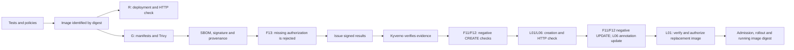

# Golden Path: verifiable delivery laboratory

This laboratory uses **quotes-node**, a synthetic quotation service without production dependencies. **L01** demonstrates a legitimate delivery followed by replacement with a different, independently verified image digest. **F13** checks that a missing signed results attestation prevents deployment. The **F11/F12/L06** family adds privileged/tag-reference rejection on CREATE and legal template UPDATE, plus a meaningful permitted update; [hosted success is recorded from a supplied review; local acceptance remains pending](docs/EN/cases/F11-F12-L06/runbook.md).

The [execution guide](docs/EN/cases/L01-F13/runbook.md) covers Codespaces, Dev Containers and GitHub, including expected results and troubleshooting. The [L01/F13 case](docs/EN/cases/L01-F13/README.md) explains the experimental claim. Historical [validation records](registros/validacion_integracion.md) distinguish observed runs from pending work and retain their original Spanish wording.

The [image-replacement validation](registros/l01_image_update_validation_EN.md) records the earlier local result. Classic hosted [run 36314305654](https://github.com/tfm-goldenpath/golden-path-lab/actions/runs/36314305654) subsequently passed on `4f8fe77`, including independent image replacement; released v0.1.0 at `9f1999e` includes that change. Preserve the recorded commit and profile for each observation.

This branch is a [bundle migration candidate](docs/EN/cosign-bundle-migration.md), with [local compatibility PASS](registros/cosign_bundles_validation_EN.md) in `run-De88fpWy`, including strict inventory retrieval; hosted L01/F13/F11 also passed at `82728c5` in [run 36321115827](https://github.com/tfm-goldenpath/golden-path-lab/actions/runs/36321115827). Local directed F07 passed in `run-xFGRe6X1`, as recorded in the [F07 record](docs/EN/cases/F07/record.md). The [early CI F07/L04 record](docs/EN/cases/L04/record.md) tracks the fresh verification gate and shared replacement execution. Hosted F07 remains `NOT_EXECUTED`; the [GHCR protocol investigation](docs/EN/cases/F07/hosted-compatibility.md) supplies an inactive probe and a bounded stopping condition. Cosign 3.1.3 emits default Sigstore bundles and Kyverno 1.19.1 consumes them for each distinct evidence requirement, including the independent image-signature predicate. The classic chain adapter is outside the active path; local development-key trust and hosted OIDC/transparency remain separate. Freeze the adopted profile after the pilot, and keep classic development timings separate from bundle campaign measurements.

## Documentation language

Implementation, operational messages and primary guides use English to follow common practice in international software development and make contribution and reuse easier. This is a project convention, not a mandatory technical standard. The thesis and supporting academic documentation remain in Spanish. Each scenario has one implementation and stable identifiers, regardless of the language used to explain it.

Use the [documentation index](docs/README.md) to browse `docs/EN/` or `docs/ES/`. Shared topics use matching filenames. The integrated case specification and runbook are grouped under each language's `cases/L01-F13/`; the actual tests remain in `tests/scenarios/`.

Spanish support: [repository introduction](../README.es.md), [execution guide](docs/ES/cases/L01-F13/runbook.md), [L01/F13 case](docs/ES/cases/L01-F13/README.md), [architecture](docs/ES/architecture.md), [delivery contracts](docs/ES/delivery-contracts.md), [environment](docs/ES/environment.md) and [initial plan](docs/ES/implementation-plan.md).

## Start in the devcontainer

Keep `implementacion/`, `.github/workflows/` and `.devcontainer/implementacion/` under the same repository root. Select the implementation configuration in Codespaces or VS Code. In its Linux terminal:

```bash
cd implementacion
make doctor
make test
make demo
```

Omit the first command when opening `implementacion` directly. The devcontainer installs pinned versions of Node, Docker, kind, Trivy, Conftest, Cosign, Helm, Kyverno CLI and act. It requests 2 CPUs, 8 GB of memory and 32 GB of storage. Effective Codespaces quotas depend on the account and its usage.

`make demo` creates an ephemeral laboratory. A successful run prints `== PASS: L01 accepted; F13 and F11 rejected; F07 status recorded for the selected lane. Evidence: <run-directory> ==`, followed by cleanup and packaging output. `<run-directory>` is the actual evidence directory for that run. Cleanup removes the temporary cluster, registry and keys while retaining evidence.



A HIGH/CRITICAL finding blocks delivery even when no fix is available. An incomplete mandatory check also stops delivery. Scan results may change when the vulnerability database changes.

## Commands and expected results

| Command | Purpose |
|---|---|
| `make doctor` | Check devcontainer tools and Docker engine. |
| `make test` | Check environment, API, contracts, orchestration, packaging and policies without requiring a cluster. |
| `make smoke-env` | Build and load an image directly into kind; does not verify a registry or signatures. |
| `make reference` | Deploy by digest into `tfm-reference` and check the HTTP response. |
| `make demo` | Exercise R/G, L01/L04, F13, local CI/admission F07 and F11/F12/L06 runtime checks. |

The reference request is `POST /quotes` with `{"insuredAmountCents":100000,"coverage":"basic"}`. Both R and G must return:

```json
{"currency":"EUR","premiumCents":1000,"tariffVersion":"demo-v1"}
```

## GitHub Actions

Workflows are in **`.github/workflows/` at the repository root**, one level above this directory:

- `ci.yml`: tests and policies on PR/push, without publication permissions.
- `golden-path.yml`: manual **Golden Path GitHub integration**; GHCR, keyless signing, native provenance through `actions/attest` and Kyverno in a kind cluster created by the runner.

The manual workflow must exist on the default branch to appear under **Actions → Run workflow**. It uses `GITHUB_TOKEN` and OIDC, not a PAT stored in project files. It targets the public thesis repository and requires its declared permissions to be allowed. The downloadable artifact is `golden-path-<run-id>-<attempt>`, retained for 14 days. Keep a local copy too.

The [GitHub configuration and protection guide](docs/EN/github-configuration.md) covers rulesets, Actions permissions, Dependabot, secret protection, optional CodeQL, SBOM export, GHCR, attestations and preservation. It distinguishes proposed settings from controls already defined in the workflows.

The local lane uses development keys and provenance. `act` can exercise compatible workflow steps, but does not replace OIDC or hosted integration. Keyless signing or `actions/attest` alone does not establish SLSA Build L3.

## Repository structure

| Directory or file | Responsibility |
|---|---|
| `services/quotes-node/` | API, validation, calculation, tests and its own Docker context. |
| `policies/conftest/` | Manifest, workflow and vulnerability rules. |
| `policies/kyverno/` | Policies with explicit trust for `tfm-golden`. |
| `scripts/demo.sh` | CLI entry point, execution order and owner of infrastructure cleanup. |
| `scripts/lib/context.sh` | Run context, state between phases, identity and traceability. |
| `scripts/lib/lab.sh` | kind, zot registry, builder, namespaces, Kyverno admission, diagnostics and cleanup. |
| `scripts/lib/delivery.sh` | Tests, early policies, build, Trivy and manifest generation. |
| `scripts/lib/attestations.sh` | Signing, verification and results-attestation issuance. |
| `scripts/lib/workload.sh` | Deployment requests and HTTP checks. |
| `tests/scenarios/l01.sh`, `f13.sh`, `f11.sh` | Scenario-specific preparation, expectations and evidence. |
| `scripts/lab-contracts.mjs` | Manifest, SBOM, provenance and results contracts. |
| `scripts/github-attestation.mjs` | Validate content already cryptographically verified by GitHub CLI. |
| `scripts/check-missing-results.mjs` | Check that F13 is prepared against the correct digest. |
| `scripts/check-image-rollout.mjs` | Check the replacement Deployment generation, readiness and running Pods' image digests. |
| `scripts/package-evidence.py` | Package evidence and its hashes. |
| `tests/` | Environment, contracts, orchestration, scenarios and positive/negative policy inputs. |
| `.devcontainer/` | Linux environment and checksum-checked installation. |
| `versions.env`, `tools.lock.json` | Pinned versions and verified references. |
| `docs/`, `registros/` | Guides, architecture and historical validation records. |
| `templates/`, `TODO.md` | Work-item templates and incremental plan. |

Controls are described in [policies/README.md](policies/README.md) and the [delivery contracts](docs/EN/delivery-contracts.md). Manifests are generated for each digest.

## Architecture and rationale

The implementation uses a **modular architecture for automation, policies and evidence, with a central laboratory orchestrator**. Each module groups a responsibility and exposes testable inputs and outputs through functions, commands or rules.

In `quotes-node`, [index.js](services/quotes-node/src/index.js) starts the process, [server.js](services/quotes-node/src/server.js) adapts HTTP, [quote.js](services/quotes-node/src/quote.js) calculates the quotation and [validation.js](services/quotes-node/src/validation.js) validates inputs. The calculation does not import Docker, Kubernetes or pipeline components. In the platform, `demo.sh` coordinates functions in `scripts/lib/`, while scenario preparation lives in `tests/scenarios/`. Conftest and Kyverno express rules; contract helpers validate evidence content; packaging retains files and hashes. Cryptographic verification belongs to Cosign, GitHub CLI and admission verifiers, not JSON validators alone.

Bash modules define functions without starting operations when imported. They share an explicit run context—mode, phase, resources, image, identity and evidence paths—within one process. `demo.sh` owns execution order and cleanup; these modules are not isolated processes or a portable framework. The interfaces remain `make demo`, `make reference`, and the GitHub phases **prepare → actions/attest → finish → cleanup**.

F13 checks rejection before results authorization exists; the evidence is then signed and L01 uses **the same digest**. F11/F12 check privileged and tag-only inputs through early policy and protected CREATE/UPDATE operations. L06 shares L01 creation and requires a real annotation update, rollout and HTTP; direct Pods use isolated names and labels. New cases add preparation and expectations under `tests/scenarios/`, reuse common functions and retain attributable diagnostics without weakening policies. See [extending a scenario](docs/EN/architecture.md#extending-a-scenario).

This organization supports:

- **Independent checks:** calculation, validators and policy generation can be tested without deploying the laboratory. Real integration then checks signatures, registry access and admission.
- **Bounded changes:** vulnerability thresholds belong to policies and their tests, without changing the quotation service. Shared conditions still require coordinated review.
- **Incremental evaluation:** R and G retain the service contract, while controls and evidence have identifiable responsibilities. Rejections can be attributed without creating a custom pipeline framework.

[NIST SP 800-204D](https://csrc.nist.gov/pubs/sp/800/204/d/final) supports integrating supply-chain controls into CI/CD stages; the concrete file layout is a project decision. Modules share context, `lab-contracts.mjs` groups several contracts and some constants appear in multiple producers and consumers. Replacing Trivy or Kyverno requires adapting inputs/outputs and repeating relevant tests. The implementation does not claim automatic tool interchangeability or a complete hexagonal architecture. The [architecture guide](docs/EN/architecture.md) explains dependencies, contracts and possible improvements.

## Scope

R and G reuse one image in this functional demonstration. This is not a timing-campaign pair and does not replace the twenty scenarios in the [plan](TODO.md).

The results attestation uses a versioned custom predicate, not a complete VSA implementation. The original CycloneDX SBOM is retained and signed. Structural checks cover the selected contract fields, not every official-schema element or inventory completeness.

The [F03/F04/L02 procedure](docs/EN/cases/F03-F04-L02/runbook.md) adds `make vulnerabilities` for isolated local fixtures, frozen scanner data and fresh positive authorization. Real package selection is recorded; fixture image/admission integration remains NOT_EXECUTED behind the pinned environment prerequisite.
