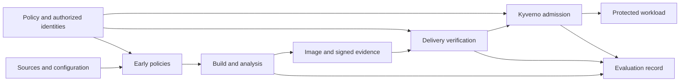
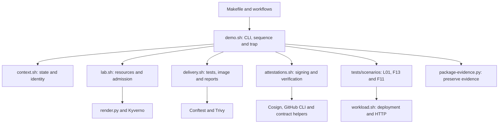

# Modular architecture of the Golden Path

[English documentation](README.md)

[Versión en español](../ES/architecture.md).

## Design decision and rationale

The implementation uses a **modular architecture for automation, policies and evidence, with a central laboratory orchestrator**. Modules group responsibilities and define how components communicate and are tested. Makefile and workflows invoke common commands; `scripts/demo.sh` parses arguments, coordinates `scripts/lib/` functions and invokes `tests/scenarios/`. Policies, validation and packaging keep specialized components. Admission rechecks applicable conditions before protected Kubernetes workloads are created or updated.

This describes the selected organization, not a new architectural standard. [NIST SP 800-204D](https://csrc.nist.gov/pubs/sp/800/204/d/final) discusses supply-chain controls across CI/CD. [Tekton Tasks and Pipelines](https://tekton.dev/docs/pipelines/) illustrate task composition with inputs/outputs, while [Konflux Enterprise Contract](https://konflux-ci.dev/architecture/core/enterprise-contract/) separates building from policy-based attestation verification before release. These precedents support separated responsibilities without requiring those platforms in this laboratory.

A practical rule is that a check should be understandable and testable without reading the entire workflow. Automation coordinates tools; policies express acceptance conditions; evidence links an artifact to those conditions. R and G preserve the same API and image during the demonstration, isolating functional effects of controls. Architecture alone does not establish reduced time or cost; those are evaluation questions.

## Responsibilities and boundaries

| Component | Responsibility | Boundary |
|---|---|---|
| `quotes-node` | Deterministic synthetic API; separate HTTP, validation and calculation. | Not an insurer's production system or actuarial model. |
| Orchestration | Order tasks, pass parameters/results, stop protected steps and preserve evidence. | `demo.sh` owns sequencing and one cleanup `trap`; modules share context rather than isolated stages. |
| Early policies | Conftest configuration checks and laboratory rules over scanner reports. | Accepted configuration does not prove later image integrity. |
| Build and analysis | Build, identify by digest and generate Trivy inventory/report. | The report must refer to the delivered object; an unchecked rebuild is insufficient. |
| Evidence and trust | Produce, sign, retrieve and verify evidence; relate subject, issuer, execution and policy. | Valid signatures alone do not prove absence of vulnerabilities or malware. |
| Admission | Kyverno rules for applicable operations in the protected namespace. | A summary does not replace agreed direct checks. |
| Evaluation | Prepare scenarios, record observations and classify results under the protocol. | Do not alter control decisions to manufacture favorable results. |

The catalogue's six blocks classify evaluated properties. They are not six microservices or six deployable modules: SBOM checks, for example, involve production, verification and admission.

## Flow and verifiable contracts

A **contract** defines what one component passes to another and what the consumer must check. It covers meaning as well as format: valid JSON naming another digest does not satisfy the delivered-image contract.

Arrows describe data/control dependencies, not a requirement to serialize every independent task.

| Contract | Minimum information and checks |
|---|---|
| Image | Digest reference, `linux/amd64` and correspondence between scanned, signed and deployed objects. Distinguish OCI index and manifest when both exist. |
| SBOM | Original CycloneDX JSON plus Cosign attestation. Check selected fields/version, expected type, signature and image association. Full-schema validation remains pending; authenticity does not prove completeness. |
| Vulnerabilities | Separate report with identifiable subject, scanner and database. Block HIGH/CRITICAL regardless of fix availability; retain incomplete-scan diagnostics. |
| Image signature | Validity, artifact correspondence and trusted identity. Constrain OIDC issuer/identity in B and configured development trust in A. |
| Provenance | Signature, trusted identity, digest, source repository/commit and required builder/workflow. Generating provenance does not automatically establish an SLSA level. |
| Results attestation | Versioned custom predicate inspired by VSA; identified policy, origin, outcome and evidence references, bound to the digest through in-toto. Issue successful authorization only after all mandatory prior checks pass; verify authenticity, type, version, outcome and required policy. |
| Control decision | Distinguish acceptance, rejection for an identified condition and inability to decide. Preserve rule/cause/identifiers. An error in a mandatory control stops the protected step. |

The summary is not presented as a conformant VSA implementation. [VSA](https://slsa.dev/verification_summary/v1) is the conceptual reference; [delivery contracts](delivery-contracts.md) specify implemented formats and checks.

Conftest uses Rego while Kyverno uses declarative resources. Shared properties require consistent valid/invalid inputs and expectations adapted to each consumer. The tools do not execute the same file, and not every early rule has an admission duplicate. References: [Conftest](https://www.conftest.dev/), [Kyverno image verification](https://kyverno.io/docs/policy-types/cluster-policy/verify-images/).

## Execution lanes and configurations

**Lane A** runs in the devcontainer with kind, zot and development signing. `make demo` directly invokes `demo.sh`; `act` additionally exercises compatible workflow steps. **Lane B** uses Actions, GHCR, real OIDC and keyless signing to validate hosted integration and identity. Reuse analysis commands where practical while keeping publication and trust configuration distinct.

**R/G** identifies the control configuration; **A/B** identifies execution environment and trust. A local rule test does not establish hosted OIDC behavior. Root `.github/workflows/` refers to `implementacion/`: CI runs on PR/push, while B uses manual `workflow_dispatch`, not yet reusable `workflow_call`. Historical [validation records](../../registros/validacion_integracion.md) retain observed local execution and distinguish pending hosted validation; they are not evidence that the imported repository has already passed B.

The public interfaces are `make demo` and `make reference`. GitHub retains **prepare → actions/attest → finish → cleanup**: preparation produces image/state, the hosted action emits native provenance, finalization consumes it, and cleanup removes resources. A local function does not substitute for the hosted attestation action.

## Implemented modules and dependencies

The [initial plan](implementation-plan.md) retains earlier proposed directories; `deploy/`, `lab/` and `contracts/` are not separate modules in this version.

| Component | Inputs/outputs and verification |
|---|---|
| [Service](../../services/quotes-node/src/) | HTTP/JSON → health, version or quote. `index.js` starts, `server.js` adapts HTTP, `quote.js` calculates, `validation.js` validates. [Service tests](../../services/quotes-node/test/) check behavior and limits. |
| [Orchestrator](../../scripts/demo.sh) and [workflows](../../../.github/workflows/) | Mode/phase/arguments → ordered module/scenario calls. One cleanup `trap`. [Orchestration tests](../../tests/unit/orchestration.test.mjs) substitute stages to check order, interruption and exit status; they do not establish real integration. |
| [Context](../../scripts/lib/context.sh) | Parameters/persisted state → run identity, resources and traceability without mixing images or attempts. |
| [Laboratory](../../scripts/lib/lab.sh) | Context/versions → kind, zot, builder, namespaces, Kyverno, diagnostics and cleanup. Real resource operations need integration. |
| [Delivery](../../scripts/lib/delivery.sh) | Sources/context → tests, early checks, image, Trivy reports and manifests. Rule unit tests do not replace a real image scan. |
| [Attestations](../../scripts/lib/attestations.sh) | Image/identities → signing, verification and results issuance. Separate cryptography, content and policy authorization. |
| [Classic chain adapter](../../scripts/complete-classic-chain.mjs) | Hosted classic OCI manifests + authenticated Fulcio material → complete public CA chain annotation and before/after report. Preserve payloads, signatures, identities and verifier roots; subsequent Cosign/admission verification remains mandatory. Temporary compatibility support, separate from the [deferred bundle migration](cosign-bundle-migration.md). |
| [Workload](../../scripts/lib/workload.sh) | Manifest/image → deployment request and HTTP check. Admission and functional response are distinct observations. |
| [Scenarios](../../tests/scenarios/) | Delivery context → L01/F13/F11 preparation and expectations. Attribute a rejection to its intended condition. |
| [Conftest policies](../../policies/conftest/) | Workflow, manifest or Trivy JSON → Rego decisions. [Policy fixtures](../../tests/policies/run_rego.py) and [real-file checks](../../scripts/check-policies.sh) exercise the rules. |
| [Contract helper](../../scripts/lab-contracts.mjs) | Parameters → manifests/predicates; verified documents → subject/type/content checks. [Contract tests](../../tests/unit/contracts.test.mjs) do not perform cryptography. |
| [GitHub adapter](../../scripts/github-attestation.mjs) and [F13 inventory check](../../scripts/check-missing-results.mjs) | Previously verified GitHub CLI output or Cosign inventory → authorized-origin/absence checks. [GitHub](../../tests/unit/github-attestation.test.mjs) and [F13](../../tests/unit/missing-results.test.mjs) tests use synthetic inputs. |
| [Kyverno generator](../../policies/kyverno/render.py) | Key/identity/repository/commit/formats → admission JSON. [Generator tests](../../tests/policies/test_render.py) and [Kyverno CLI tests](../../tests/policies/run_kyverno.py) cover configuration; retrieval/signatures need real integration. |
| [Packaging](../../scripts/package-evidence.py) | Evidence/state → archive and hashes. [Packaging tests](../../tests/unit/packaging.test.mjs) cover repeatability and credential exclusion. |

Arrows summarize responsibilities and data exchange, not imports or security isolation. The service does not import the pipeline. Bash modules/scenarios load into one process without executing checks or creating resources on import. `demo.sh` decides when to invoke them and owns its cleanup `trap`; `lab.sh` performs removal operations. External helpers communicate through CLI arguments, files and exit codes.

Cryptographic verification precedes content acceptance. Decoding JSON or checking fields does not verify a signature; inspecting the F13 inventory is also distinct from cryptographic attestation verification.

### Shared run context

| Group | Main values | Purpose |
|---|---|---|
| Execution | `root`, `mode`, `phase` | Resolve paths and select lane/phase. |
| Preservation | `state_dir`, `private`, `state.json` | Preserve evidence/state while separating temporary private material. |
| Resources | `id`, `cluster`, `registry`, `builder`, `port_pid` | Identify the run's resources and HTTP access process for diagnostics/cleanup. |
| Artifact | `image_repo`, `digest`, `image` | Preserve image identity across analysis, signing and deployment. |
| Origin and trust | `repository`, `commit`, `sign_args`, `verify_args` | Apply the selected lane's source identity and signing/verification parameters. |

Functions require the initialized context. A module must not silently redefine image digest, identities or run directories. GitHub phases restore persisted state because Bash variables do not automatically transfer between processes.

`sourceSnapshot` includes selected tests, service files, scripts, policies, versions and workflows. Orchestration tests use an isolated coordinator copy with external stages substituted: they verify flow, not real signatures, network connectivity or admission.

### Extending a scenario

`l01.sh` checks legitimate delivery. `f13.sh` checks missing-results rejection before authorization is issued, then L01 consumes the same digest. `f11.sh` checks early privileged input and a forbidden update after legitimate admission. Common resources and evidence production stay in laboratory modules.

1. Define valid input, alteration, expected outcome and attributable diagnostic in the case specification.
2. Add preparation/check functions under `tests/scenarios/`, without import-time effects. Reuse context and common operations.
3. Load the file from `demo.sh` and invoke it in the correct phase, respecting evidence availability. Invoke stages directly: wrapping an entire function in `if`, `!` or `||` can disable Bash error stopping inside it. Capture expected rejection at the specific command. Do not alter policy or allowed identity to force success.
4. Preserve preparation and response. Distinguish policy rejection, infrastructure error and an unreached control; check the legitimate counterpart.
5. Review effects on other scenarios and run appropriate tests before recording results. Adding functions alone does not establish that a scenario ran.

Mutations belong to scenarios; rules belong to controls. A scenario requiring a new Golden Path capability introduces that capability separately, with requirements and tests. Shared cleanup retains one owner.

## Limitations and architectural alternatives

Modules deliberately share context and central order. `lab-contracts.mjs` groups generation, validation and file access; predicate URIs, required checks and policy versions also appear in producers/consumers. A change needs coordinated review. If duplication becomes costly, introduce versioned shared configuration and explicit consistency checks; current tests do not prove all such consistency.

Trivy-specific report rules and Kyverno APIs need adaptation when replacing tools, followed by tests of representation, trust and rejection attribution. A stable property does not make implementations interchangeable automatically. In the service, `RequestError` includes HTTP status shared with the adapter; separating that mapping would help reuse beyond HTTP. The current service does not claim a full hexagonal architecture.

The twenty experimental scenarios do not limit the number of automated tests. Mandatory guarantees also need tests for unauthorized identity, wrong digest, unsuccessful result, forbidden predicate type/version, missing fields, retrieval failures and verifier errors. Distinguish attributable rejection from external unavailability even if both stop delivery. Also check protected scope, relevant CREATE/UPDATE operations and directed later barriers. Methodology and catalogue selection remain in the [thesis repository](https://github.com/tfm-goldenpath/golden-path).

Domain-Driven Design is not adopted: the primary responsibilities concern delivery automation and verification, and this synthetic service does not justify aggregates or domain repositories. See [Microsoft's DDD guidance](https://learn.microsoft.com/en-us/azure/architecture/microservices/model/domain-analysis). DSRM structures research, TDD guides construction and modular architecture organizes the artifact.

Hexagonal architecture may become useful for stable domain logic with interchangeable providers; Tekton/Konflux may supply a fuller build/release platform. Current scope favors bounded integration of existing tools over additional subsystems. Introduce further structure when growth or reuse justifies it, not to populate empty directories.
