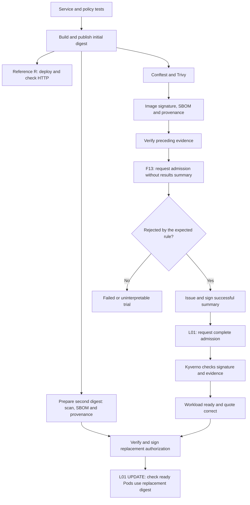

# Integrated L01/F13 case: authorized delivery and missing mandatory summary

[English documentation](../../README.md)

[Versión en español](../../../ES/cases/L01-F13/README.md).

## Selection and purpose

**L01 (legitimate delivery)** and **F13 (missing results attestation)** require both preceding checks and admission consumption to work together. An isolated signature test would establish a narrower property. F13 is interpretable only when the image, signature, SBOM and provenance are otherwise valid. L01 is the positive control for the same configuration.

`quotes-node` provides a deterministic functional contract. The evaluated object is **authorization of a delivery identified by digest**, not API sophistication or actuarial modeling. The signed summary describes previous verification results; it does not claim the deployment has already been admitted.

| Field | Definition for this first demonstration |
|---|---|
| Identification | L01 + F13, integrated trial before the statistical pilot. |
| Asset | `linux/amd64` image of `quotes-node`, associated evidence and deployment request to `tfm-golden`. |
| Bounded capability | Present an image with otherwise valid evidence before issuing the required summary. The policy, trust settings and cluster administration cannot be changed. |
| F13 fault condition | No valid signed results attestation exists for the submitted digest. |
| Expected stage | Kubernetes admission, in a directed check of the later barrier. |
| Blocking boundary | Before admitting the protected workload; detecting it after execution is insufficient. |
| F13 oracle | Rejection attributable to the mandatory-results policy, with other conditions verified. |
| L01 oracle | Initial admission and healthy response; subsequently, an authorized UPDATE to a different image digest, with the Deployment and ready Pods running that digest and preserving the quote contract. |
| Evidence | Digest, trust settings, policies, reports, verification results, admission responses and HTTP result. |
| Scope | Local lane A and hosted lane B, with distinct documented identity mechanisms. |

## Flow and preparation order

Use isolated run state so the digest does not inherit a successful summary from an earlier trial. **F13 runs before the summary is published**; it does not delete evidence belonging to another delivery or weaken policy to obtain rejection. If the registry already holds reusable authorization for the trial image, absence has not been demonstrated and preparation must be isolated again.

After F13, the issuer publishes the summary only if mandatory preceding checks passed. Admission is not included as a circular prerequisite. Kyverno's final authorization and functional response are recorded afterwards.

L01 also replaces the running image. A second build uses the same source commit with a distinct laboratory build label, producing a different immutable digest; this tests image replacement, not a functional application upgrade. That digest receives its own Trivy report, SBOM, signature, provenance and signed results. The UPDATE must pass the existing admission controls, complete its rollout and leave ready Pods reporting the new runtime image digest. The initial image's evidence is not reused to authorize its replacement.

## Integrated properties and controls

| Required property | Laboratory implementation | Observable evidence |
|---|---|---|
| Known functional behavior | Node, `node:test`, health, version and quote | Tests and deployed application responses. |
| Immutable common artifact | zot/GHCR publication and SHA-256 digest references | Same image reference for analysis, signing and deployment. |
| Restricted configuration | Conftest/admission: non-root, no privileges/escalation, dropped capabilities, read-only filesystem and restricted host access | Policy result and submitted manifest. |
| Controlled workflow use | Selected rules for pinned actions, events and permissions | Conftest diagnostics for evaluated workflows. |
| Vulnerability threshold | Trivy, blocking HIGH/CRITICAL even without a fix | Original report and policy decision. |
| Inventory linked to artifact | Original CycloneDX JSON inside a signed attestation | Retained SBOM, type, version, subject and verification. |
| Image authenticity | Cosign image signature | Valid signature for the authorized digest and identity. |
| Verifiable provenance | Signed local contract in A; GitHub hosted attestation consumed as Sigstore bundle in B | Repository, commit, build and allowed identity correspondence. |
| Results authorization | Versioned custom summary inspired by VSA, signed with Cosign | Predicate type, subject, policy, previous results and identity. |
| Condition enforcement | Kyverno in the protected namespace, retaining direct checks | Attributable F13 rejection and L01 acceptance. |

The results summary is a **custom contract**, not full VSA conformance. It does not replace direct admission checks for image signature, SBOM and provenance. Policies run in a real laboratory Kubernetes cluster created with kind inside Docker; admission is not simulated with a hard-coded API response.

The lanes preserve required properties but establish different evidence. A's local key exercises development contracts and signatures. B checks real OIDC identity, transparency and GitHub provenance. Obtaining a signature or attestation alone does not establish SLSA Build L3.

## Decisions and error handling

The directed F11 check sets `privileged=true` together with `allowPrivilegeEscalation=true`. Kubernetes rejects the combination of privileged mode and explicitly disabled escalation before Kyverno evaluation. The demonstration therefore first checks API validity with `--dry-run=server` in R and retains the diagnostic. It then checks early Conftest rejection and G's update rejection by `tfm-runtime`. Dry-run does not change the reference workload.

| Observation | Interpretation |
|---|---|
| F13 rejected for missing summary; initial L01 and its distinct-image UPDATE admitted, ready and functional | Oracle satisfied within the recorded versions and conditions. |
| F13 admitted | Barrier efficacy or trial isolation failed; retain as an unfavorable observation. |
| F13 rejected for another missing/invalid evidence item | Rejection cannot be attributed to the required summary. Correct preparation and repeat. |
| Network, verifier, registry or webhook failure | Operational incident, not a correct F13 detection. |
| Blocking vulnerability before reaching F13 | The earlier control works, but L01/F13 integration remains incomplete. |
| L01 admitted but not ready or returning an incorrect quote | Functional delivery failed despite successful admission. |

Success is not inferred from a generic `kubectl` exit code. Retain the diagnostic and identify the responsible rule. An evidence package's existence does not imply every step succeeded.

## Comparison and limitations

R and G initially share the service and digest. L01 then exercises a second digest only in G to check a legitimate image replacement. The initial comparison exposes G's additional conditions and shows that R does not require the experimental summary. The extra UPDATE build is not an independent R/G pair: this illustration neither establishes a general detection rate nor covers all twenty scenarios or a valid timing campaign.

Omitting the summary is a controlled fault modeling incomplete delivery or a route lacking required authorization. It does not demonstrate resistance to complete administrator, authorized-runner or trust-root compromise. It also does not establish absence of malware or complete regulatory compliance. Traceability can support technical evidence for risk/change management; applying it to an insurer requires organizational context and additional controls.

The [execution guide](runbook.md) separates local commands, hosted workflow, expected outputs and preparation failures. The subsequent pilot must establish interoperability, resource use and reproducibility before campaign conditions are fixed.
