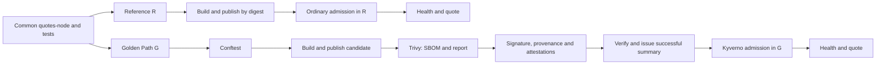

# Plan for the first integrated base

Current evaluation scope and final-source requirements are consolidated in the
[twenty-scenario readiness matrix](evaluation-readiness.md). Human-effort
measurement and eligible manual calibration are deferred; historical observations
below keep their original source and review status.

[English documentation](README.md)

[Versión en español del plan de origen](../ES/implementation-plan.md).

This document preserves the **implementation plan for the first integrated base**: `quotes-node`, reference path R and Golden Path G. Code, tests and automation now exist for L01/F13 and early/directed F11 checks. Availability of that code does not establish end-to-end acceptance of the imported repository or completion of the twenty-scenario campaign.

Use the [README](../../README.md) and [execution guide](cases/L01-F13/runbook.md) for current commands, [delivery contracts](delivery-contracts.md) for implemented guarantees and [TODO](../../TODO.md) for progress. The milestones below explain the construction sequence; they are not a claim that every milestone has passed.

## 1. Starting point and scope

The existing devcontainer and Codespaces adapter, `test-env`, `doctor` and `smoke-env` are reused. The infrastructure probe builds an image and loads it directly into kind, so it does not establish registry access, digest pulling, signatures or admission. Historical [environment records](../../registros/validacion_entorno.md) retain the original preparation results, including a run that failed before Docker/kind because Node was unavailable in its invoking environment. Host-only checks do not establish the pinned devcontainer runtime.

The installer includes Trivy, Conftest, Cosign, Helm, Kyverno CLI and act; `tools.lock.json` also pins laboratory images. Retain download hashes/digests and check actual interoperability. The implementation root's `.dockerignore` serves devcontainer preparation. Build the service with its own **`services/quotes-node/` context**, Dockerfile and `.dockerignore`.

Minimum demonstration:

1. The legitimate service returns the same response through R and G.
2. G delivers an identified image, generates/verifies required evidence and obtains admission.
3. A forbidden configuration fails early with an attributable reason; a directed trial checks the later admission barrier.
4. Missing mandatory evidence causes a rejection distinguishable from network/verifier failure.
5. Hosted integration verifies real OIDC identity and provenance through Kyverno.

All twenty fault injections are not prerequisites for this first demonstration. A partial route is an integration check, not complete L01 acceptance.

## 2. Synthetic service contract

Use a deterministic HTTP API without personal data, database, user interface or external services. Node and `node:test` suffice; the initial service uses `node:http` without production dependencies. Separate transport, validation and calculation.

| Operation | Expected behavior |
|---|---|
| `GET /healthz` | `200`, `{"status":"ok"}`. |
| `GET /version` | `200`, service name/version/build commit matching the delivery. |
| `POST /quotes` | `200`, synthetic premium in cents, currency and tariff version. |

Input `insuredAmountCents` is an integer from 100 to 100000000 inclusive; `coverage` is `basic` (1%) or `extended` (2%), rounded up to the nearest cent. Invalid input returns `400` with an identifiable code. These are test rates, not actuarial calculations.

```json
{"insuredAmountCents":100000,"coverage":"basic"}
```

Expected response:

```json
{"currency":"EUR","premiumCents":1000,"tariffVersion":"demo-v1"}
```

Use integer arithmetic without clocks, randomness or external rates. Check calculation, validation, health and HTTP behavior. Run on port 3000 as a nonprivileged user with a read-only filesystem. Preserve this contract across Docker, kind and Actions.

No production npm dependencies simplifies bootstrap but does not demonstrate npm vulnerability detection. F03/F04 later require real, prepared inputs under their case specifications; do not add a vulnerable dependency to the legitimate service solely to manufacture a finding.

Suggested deliverable: “As a developer, I want a verifiable quotes-node delivery so that I can compare the reference and protected paths.” Split tasks by milestones, not one story per file or command.

## 3. Two configurations and two execution lanes

**R/G** selects controls. **A/B** selects execution environment and evidence identity; these are not four independent products.

| Aspect | Reference R | Golden Path G |
|---|---|---|
| Source and functional tests | Same revision and service contract. | Same revision and service contract. |
| Build/publication | Automated `linux/amd64` image. | Same functional build with added controls. |
| Legitimate deployment | Digest reference in reference namespace. | Digest reference in protected namespace. |
| Early experimental security policies | Not required. | Conftest manifest and selected workflow rules. |
| Security evidence | Not required to authorize R. | Trivy, attested SBOM, image signature, provenance and signed results. |
| Admission | Ordinary Kubernetes validation remains. | Kyverno checks mandatory experimental conditions. |
| Common evidence | Commit, configuration, image, versions, deployment and HTTP response. | Common evidence plus control outputs. |

R retains automation and tests; it is not “no process.” Keep one service implementation. Lane A uses the devcontainer, Docker/Buildx, zot, kind and development keys; `act` covers compatible workflow steps. Lane B uses Actions, GHCR, real OIDC, keyless signing and hosted provenance. Development trust must not authorize B.



Publishing a candidate permits analysis and evidence association; it does not authorize deployment. Do not rebuild between scanning, signing and deployment. Reusing one artifact is useful for functional diagnostics but is not a timing pair including two independent builds.

## 4. Repository organization

The separate `golden-path-lab` repository retains `implementacion/`. GitHub workflows must be at root `.github/workflows/`; placing them only inside the implementation directory does not activate them.

Current structure is described in the [README](../../README.md#repository-structure) and [architecture guide](architecture.md). The original plan proposed `deploy/`, `lab/`, `contracts/`, additional workflow files and more Make aliases. These are prospective options, not required current directories. The implemented base instead uses `scripts/demo.sh`, `scripts/lib/`, scenario functions, contract helpers and policy generation. Create a module directory when it has a real component and test.

Workflows wrap reusable commands. R cannot obtain successful security attestations merely through a `reference` parameter without executing G's controls. Trust configuration must not come from arbitrary deployment-request input. Keep the runtime base separate from the development image so compilers and utilities are not shipped unintentionally.

## 5. Milestones and acceptance evidence

| Milestone | Concrete work | Acceptance evidence |
|---|---|---|
| H0. Real environment | Build devcontainer; run existing environment commands. | Passing `test-env`, `doctor`, `smoke-env` in Linux; reviewed versions, logs and cleanup. |
| H1. Service | Define contract tests first; implement API and Dockerfile. | Exact quote, invalid-input rejection, health and version in Node and Docker. |
| H2. Reference R | Add zot/kind; publish/deploy by digest; preserve functional output. | Node pulls from registry, application ready and responding. `kind load` or `Never` pull policy alone does not close this. |
| H3. First G barrier in A | Install Kyverno and a signature rule; sign with development key. | Legitimate image admitted; unsigned variant rejected by the identified rule. Node and Kyverno can reach the registry. |
| H4. Critical B integration | Hosted build/GHCR/keyless/provenance and direct Kyverno verification. | Authorized-origin acceptance and attributable negative evidence/origin test. CLI-only or act does not close it. |
| H5. Complete basic G | Integrate Conftest, Trivy, attested SBOM, provenance and signed custom summary; retain direct checks. | Legitimate path meets mandatory profile conditions with correlated artifacts and attributable initial negatives. |
| H6. Reproducible demonstration | Execute from documentation and retain package; exercise compatible local workflow steps with act. | Another run reproduces the procedure/expectations, identifies errors and retains interpretable evidence. |

H3 is a limited signature/admission check, not yet the complete Golden Path. H4 addresses the most uncertain integration early. Build H5 capabilities individually and review their evidence before closure. Mandatory contracts require positive and negative tests even when not separate measured scenarios.

Local H5 work can proceed while preparing hosted integration, but a complete technology demonstration still requires H4. Publication is a separate maintainer action; this plan does not automatically publish changes or releases.

## 6. Integrations requiring explicit verification

### Registry, network and admission

Start with one laboratory zot and one kind node. `tfm-reference` and `tfm-golden` distinguish configurations; experimental Kyverno rules apply only to the protected namespace. Deployment requests cannot remove or change that scope.

Choose the canonical registry address before signing. Verify access from the publishing client, pulling nodes and Kyverno evidence consumer. DNS, ports and HTTP/TLS must cover all three: a containerd `localhost` alias does not configure access from Pods. See [kind local registries](https://kind.sigs.k8s.io/docs/user/local-registry/).

A may use an isolated HTTP development registry when explicitly configured in every consumer. Do not expose it publicly or mix its trust with B. Resolve transport failures without dropping cryptographic checks. Kyverno CRDs/webhooks must be ready before the trial, with fail-closed behavior for protected operations. Pin Helm/chart/values and record environment setup separately from delivery measurements.

### Image and evidence

Retain the published digest, platform and OCI index/manifest relation where relevant. Trivy analyzes that object and emits **original CycloneDX JSON** plus **a separate vulnerability report**. Inventory generation does not itself apply vulnerability policy. [Trivy SBOM documentation](https://trivy.dev/docs/latest/supply-chain/sbom/).

Block HIGH/CRITICAL even without fixes. A legitimate candidate must meet that threshold under a real scan with identified data. If it fails, review components/base and preserve the diagnosis; Node LTS does not guarantee PASS. Rule unit tests use synthetic reports; integration uses real scans. [Trivy filtering](https://trivy.dev/docs/latest/configuration/filtering/).

Cosign image signatures and signed attestations are distinct. For SBOM evidence, check retrieval, authenticity, predicate type and matching subject. Verify the chosen formats with actual versions. [Cosign attestation verification](https://docs.sigstore.dev/cosign/verifying/attestation/).

### GitHub provenance and Kyverno

Fix issuer, identity, repository, workflow/builder, commit, format and storage together. The current [migration candidate](cosign-bundle-migration.md) has local compatibility PASS with strict inventory retrieval; hosted trust and actual F07 negative admission remain pending. For the campaign, R and G use the same frozen revision, with G's experimental evidence/admission controls omitted in R; classic development and bundle campaign timings remain separate. The candidate uses Sigstore bundles for all required evidence; a common representation does not establish equal trust or successful retrieval for Cosign and GitHub producers. Exercise issuance, publication, retrieval and the actual consumer decision. References: [GitHub attestations](https://docs.github.com/en/actions/how-tos/secure-your-work/use-artifact-attestations/use-artifact-attestations), [Kyverno and Sigstore](https://kyverno.io/docs/policy-types/cluster-policy/verify-images/sigstore/).

The initial design considered a reusable builder. The first implementation uses native `actions/attest` in a manual workflow and `SigstoreBundle` verification without claiming builder isolation or SLSA Build L3. Preserve specific failures before adapting an incompatible combination. Local provenance does not establish hosted identity. Run kind in the GitHub runner instead of exposing a Codespace cluster API.

### Results authorization and admission semantics

The custom summary inspired by VSA has type/version, subject, policy/version, outcome, execution and verifiable evidence references. Issue success only after mandatory prior checks. Record admission afterwards to avoid a circular requirement. Verify identity, signature, subject, type/version, policy and result, retaining direct image/evidence checks.

Check that automatic tag mutation does not hide F12 and verification caching does not mask missing evidence. Expected semantics reject tag-only delivery. Negative trials need isolated/restored state and documented cache behavior. [Kyverno verification, mutation and caching](https://kyverno.io/docs/policy-types/cluster-policy/verify-images/overview/).

`act` follows working commands and tests compatible local behavior; real OIDC, permissions and runner specifics require B. [act limitations](https://nektosact.com/not_supported.html).

## 7. Initial expectations

| Trial | Preparation and expected observation |
|---|---|
| L01 | Conforming image/manifest and completed mandatory checks → admission, readiness and exact quote. |
| F11 early | Privileged input → Conftest rejects by its rule before deployment. |
| F11 later | Directed admission check → Kyverno rejects the expected condition. Current preparation also sets `allowPrivilegeEscalation=true` so Kubernetes API validation does not reject first; see the [case specification](cases/L01-F13/README.md#decisions-and-error-handling). |
| F07, signature absent | Planned isolated input with other evidence valid → attributable missing-image-signature rejection. |
| F09/F10, provenance | Planned absence/unauthorized-origin checks → attributable provenance rejection, not network unavailability. |
| F13, results absent | Valid image signature/SBOM/provenance before summary issuance → missing-results authorization rejection; then issue summary and exercise L01 on the same digest. |

Current complete-demonstration code covers L01/F13 and directed F11 checks; the listed F07/F09/F10 expectations are additional planned integration checks, not claims of executed results. Preserve preparation and distinguish test outcome, control decision and operational state. A generic `kubectl` failure is not detection.

R's adverse-input behavior must be observed, not assumed: ordinary Kubernetes restrictions may reject it even without G's policies. A server dry-run can check API admission without actually running a privileged reference workload.

## 8. Commands and evidence

Current commands, from `implementacion/` in the devcontainer:

```bash
make test-env
make doctor
make smoke-env
make test
make demo
make reference
```

`make test` covers environment/service/validators/policies. `make demo` runs local R/G with L01/F13/F11; `make reference` runs only R. B uses the root manual workflow. Additional original aliases such as `make golden`, `make lab-up` or `make test-integration` are prospective and must not be assumed to exist; consult the actual [Makefile](../../Makefile).

Each run uses its own identifier and explicit resource parameters. Preserve commit, R/G configuration, A/B lane, policy/tool versions, image/platform/digests, original reports/attestations/verifications, admission request/response/rule and functional checks. Diagnostic time is not automatically campaign data.

Raw evidence is ignored under `evidence/raw/<run-id>/`; reviewed summaries may go in `registros/`. Hosted execution uploads evidence where possible even on failure. Downloading and retaining an outside-Codespaces copy is part of H6. A later release-associated package follows the evaluation protocol without adding encryption or another custody service.

## 9. Hosted readiness and responsible assistance

Before B, verify the published repository/ref, workflow paths, authorized identities and GHCR permissions. No private keys or long-lived credentials belong in Git. A's ignored local keys are not trusted by B. Pin each integration's version/source/checksum, review its license and retain compatibility evidence. Student quotas are not unlimited capacity; no paid service is introduced to complete this base.

Copilot assistance follows the approved method: human requirements/oracles, bounded assignments, automated checks and human review. The repository now provides [contribution guidance](../../../CONTRIBUTING.md), root `AGENTS.md`, Copilot instructions and a scoped scenario-change skill. The [assistance guide](ai-assisted-development.md) explains their use and the lightweight evidence record. Check that the intended Copilot client loads these files and validate the process on a bounded task before marking operational adoption complete. Historical drafts are not active configuration; hooks, custom agents and MCP integrations remain optional. Automatic review does not count as human review, and AI remains excluded from measured manual tasks and runtime authorization.

## 10. Completion and next work

The base is complete when the service, R, G, B integration and initial negatives produce interpretable evidence within declared limits. Installed executables and YAML alone do not close it. Preserve failed observations and resolve or delimit incompatibilities.

Then complete remaining case specifications/injections, required contract tests, four pilot pairs and six agreed manual tasks. Freeze campaign versions and revise the provisional ten-pair target after the pilot. This plan does not change the overall budget, add analyzer comparisons or treat the first demonstration as statistical evaluation.

Current execution schedule: use the separate [automated remediation validation](automated-remediation.md) for F03/F10/F11 × R/G. Human-effort comparison and eligible manual calibration are deferred, not completed by automation. Historical rehearsals, review formats, the separate PR #43 paired campaign and pending overall pilot acceptance remain unchanged.
