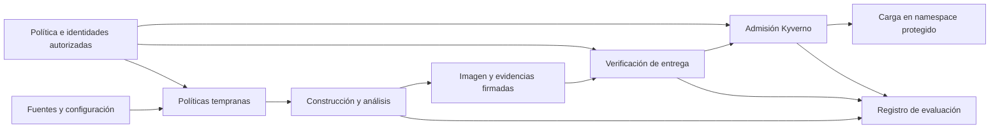
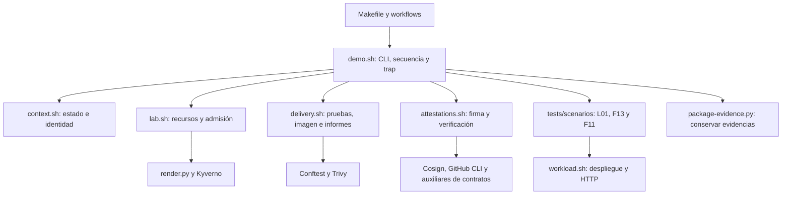

# Arquitectura modular del Golden Path

[Documentación en español](README.md)

[Guía principal en inglés](../EN/architecture.md). Este documento se conserva como apoyo en español; el código, los mensajes operativos y los identificadores de escenarios son comunes a ambos idiomas.

## Decisión de diseño y fundamento

Se adopta una **arquitectura modular de automatización, políticas y evidencias, con un orquestador central del laboratorio**. La modularidad consiste en agrupar responsabilidades y definir cómo se comunican y prueban sus componentes. Makefile y los workflows invocan comandos comunes; `scripts/demo.sh` recibe los argumentos, coordina funciones de `scripts/lib/` e invoca los escenarios de `tests/scenarios/`. Las políticas, validaciones y el empaquetado mantienen sus componentes especializados. La admisión vuelve a comprobar las condiciones aplicables antes de incorporar o actualizar una carga en el ámbito protegido de Kubernetes.

Esta denominación describe la organización elegida; no introduce un estándar arquitectónico nuevo. NIST SP 800-204D trata la integración de controles de cadena de suministro en las etapas de CI/CD. Tekton ofrece un ejemplo real de composición de tareas con entradas y salidas, mientras que Konflux separa la construcción de la verificación de atestaciones mediante políticas antes de liberar una imagen. Estos antecedentes fundamentan la separación de responsabilidades, sin exigir instalar esas plataformas en el laboratorio. [NIST SP 800-204D](https://csrc.nist.gov/pubs/sp/800/204/d/final), [Tekton: Tasks and Pipelines](https://tekton.dev/docs/pipelines/), [Konflux: Enterprise Contract](https://konflux-ci.dev/architecture/core/enterprise-contract/).

El criterio práctico es que una regla o verificación pueda comprenderse y probarse sin leer todo el workflow. La automatización coordina las herramientas existentes; las políticas expresan condiciones de aceptación y las evidencias permiten comprobar qué artefacto satisface esas condiciones. La separación facilita cambios acotados y pruebas por componente. La demostración de R y G conserva la misma API y la misma imagen, lo que permite estudiar el efecto funcional de los controles sin cambiar el servicio. Esta organización no demuestra por sí sola una reducción de tiempos o costes: esos resultados corresponden a la evaluación.

## Responsabilidades y límites

| Componente | Responsabilidad | Límite |
|---|---|---|
| Servicio `quotes-node` | Proporcionar una API sintética, determinista y comprobable para recorrer la entrega. Separar transporte HTTP, validación y lógica de cotización. | No representa un sistema asegurador real ni incorpora un modelo actuarial. |
| Orquestación | Ordenar tareas, trasladar parámetros y resultados, detener pasos protegidos y conservar evidencias. | `demo.sh` conserva el recorrido y un único `trap` de limpieza; los módulos comparten contexto y no son etapas aisladas. |
| Políticas tempranas | Comprobar configuraciones mediante Conftest y aplicar las condiciones del laboratorio a resultados del analizador. | Una configuración permitida no acredita la integridad posterior de la imagen. |
| Construcción y análisis | Construir la imagen, identificarla por digest y generar inventario e informe de vulnerabilidades mediante Trivy. | El informe debe corresponder al objeto que se entrega; reconstruir sin comprobar esa identidad no basta. |
| Evidencias y confianza | Generar, firmar, recuperar y verificar firmas y atestaciones; relacionar objeto, emisor, ejecución y política. | Una firma válida no garantiza por sí sola ausencia de vulnerabilidades o malware. |
| Admisión | Aplicar las políticas Kyverno sobre las operaciones pertinentes del namespace protegido y verificar las evidencias requeridas. | El resultado resumido no sustituye las comprobaciones directas acordadas. |
| Evaluación | Preparar escenarios, registrar observaciones y clasificar resultados según el protocolo. | No modificar la decisión de un control para producir un resultado favorable. |

Los seis bloques del catálogo clasifican propiedades evaluadas. No equivalen a seis microservicios ni a seis componentes desplegables: una comprobación sobre SBOM, por ejemplo, interviene en generación de evidencias, verificación y admisión.

## Recorrido y contratos verificables

Un **contrato** define la información que un componente entrega a otro y las condiciones que el consumidor debe comprobar. Incluye tanto el formato como su significado: un JSON bien formado con un digest ajeno no satisface el contrato de la imagen entregada.

La orquestación coordina el recorrido. Las flechas representan datos y dependencias de control; no obligan a ejecutar todas las tareas de forma estrictamente secuencial cuando sean independientes.

| Contrato | Información mínima y comprobación |
|---|---|
| Imagen | Referencia por digest y plataforma `linux/amd64`. Comprobar la correspondencia entre objeto analizado, firmado y desplegado; identificar índice OCI y manifiesto si aparecen ambos. |
| SBOM | CycloneDX JSON conservado como archivo original y como contenido de una atestación Cosign. La base comprueba campos mínimos, versión seleccionada, tipo esperado, firma y asociación con la imagen. La validación completa del esquema sigue pendiente; su autenticidad no acredita la completitud del inventario. |
| Vulnerabilidades | Informe separado del SBOM, con objeto analizado, versión del analizador y base de datos identificables. Aplicar el bloqueo de HIGH o CRITICAL, exista o no corrección; conservar también el diagnóstico de análisis incompleto. |
| Firma de imagen | Verificar validez, correspondencia con el artefacto e identidad admitida. En la vía B comprobar emisor e identidad OIDC autorizados; en la vía A utilizar exclusivamente la confianza de desarrollo configurada. |
| Procedencia | Verificar firma e identidad autorizada, digest, repositorio fuente, commit y constructor o workflow requerido. Fijar la representación exacta durante la integración con Kyverno; generar procedencia no demuestra automáticamente un nivel SLSA. |
| Atestación de resultados | Predicado propio versionado, inspirado en VSA, con política identificada, origen, resultado y referencias a evidencias, vinculado al digest mediante la declaración in-toto. Emitir autorización satisfactoria solo si todos los controles obligatorios concluyen satisfactoriamente. Verificar autenticidad, tipo, versión, resultado y política exigida antes de aceptarla. |
| Decisión de un control | Distinguir aceptación, rechazo por una condición identificada y error que impide decidir. Conservar regla, causa e identificadores necesarios para atribuir la respuesta. Un control obligatorio con error detiene el paso protegido. |

La atestación de resultados utiliza un predicado propio versionado y no se presenta como implementación conforme de VSA. VSA sirve como referencia conceptual de una evaluación asociada a una política. Los [contratos de la entrega integrada](delivery-contracts.md) concretan el formato y las comprobaciones implementadas. [Especificación VSA](https://slsa.dev/verification_summary/v1).

Conftest utiliza políticas Rego y Kyverno utiliza sus propios recursos declarativos. Se comprobará la coherencia de las propiedades compartidas mediante entradas válidas e inválidas y expectativas comunes, adaptando la representación de cada entrada a su consumidor. No se presupone que ambos ejecuten el mismo archivo ni que toda regla temprana tenga una réplica en admisión. [Conftest](https://www.conftest.dev/), [Kyverno: verificación de imágenes](https://kyverno.io/docs/policy-types/cluster-policy/verify-images/).

## Dos vías de ejecución

La **vía A** ejecuta el laboratorio desde el devcontainer con kind, zot y firma de desarrollo. `make demo` invoca directamente `demo.sh`; `act` permite probar adicionalmente los pasos compatibles de los workflows. La **vía B**, con GitHub Actions, GHCR, OIDC real y firma keyless, está destinada a verificar la integración alojada y sus identidades. Los comandos de análisis y sus entradas se reutilizan cuando sea posible; la confianza, las credenciales y los mecanismos de publicación se configuran de forma diferenciada.

Una prueba local de la regla no acredita la integración de OIDC ni el comportamiento del servicio alojado. Los workflows están en **`.github/workflows/`, en la raíz del repositorio**, y referencian los componentes de `implementacion/`. CI ejecuta las pruebas en PR y push; la integración de B es manual mediante `workflow_dispatch`. Todavía no se ha convertido en un workflow reutilizable mediante `workflow_call`. El [registro histórico de validación](../../registros/validacion_integracion.md) describe su alcance registrado; la [guía de ejecución](cases/L01-F13/runbook.md) distingue la sustitución de imagen alojada satisfactoria con perfil clásico del candidato bundle, cuya prueba local con recuperación estricta pasó mientras siguen pendientes la admisión negativa real de F07 y OIDC, SCT y registro de transparencia reales en la vía alojada.

Las entradas locales siguen siendo `make demo` y `make reference`. En GitHub se mantiene la secuencia **prepare → actions/attest → finish → cleanup**: la preparación produce la imagen inicial y la de sustitución L01 con estados separados; dos pasos de la acción alojada emiten procedencia nativa para sus respectivos digests. La finalización verifica cada entrega y la limpieza retira los recursos compartidos. No se sustituye la acción alojada por una función local.

## Organización implementada y dependencias

Las rutas siguientes existen en la base actual. El [plan de la primera base integrada](implementation-plan.md) conserva el diseño inicial; las carpetas `deploy/`, `lab/` y `contracts/` allí propuestas no son módulos separados en esta versión. R/G expresa la configuración de controles; A/B expresa el entorno de ejecución y su modelo de confianza.

| Componente y código | Entrada y salida principales | Comprobación separada |
|---|---|---|
| [Servicio](../../services/quotes-node/src/) | HTTP/JSON → cotización, salud o versión. `index.js` arranca el proceso; `server.js` adapta HTTP; `quote.js` calcula; `validation.js` valida. | [Pruebas del servicio](../../services/quotes-node/test/): cálculo, límites y comportamiento HTTP. |
| [Orquestador](../../scripts/demo.sh) y [workflows](../../../.github/workflows/) | Modo A/B, fase y argumentos → llamadas ordenadas a módulos y escenarios; responsabilidad de retirar la infraestructura. | [Pruebas de orquestación](../../tests/unit/orchestration.test.mjs) con etapas simuladas: fases, interrupción y códigos de salida. La integración completa requiere el ensayo real. |
| [Contexto](../../scripts/lib/context.sh) | Parámetros y estado conservado → identidad, recursos e información de trazabilidad del intento. | Comprobar inicialización y recuperación de las fases sin mezclar imágenes o intentos. |
| [Laboratorio](../../scripts/lib/lab.sh) | Contexto y versiones → kind, zot, builder, namespaces y admisión Kyverno; diagnóstico y retirada de recursos. | La creación, conectividad y limpieza requieren el entorno real. |
| [Entrega](../../scripts/lib/delivery.sh) | Fuentes y contexto → pruebas, políticas tempranas, imagen construida, informes Trivy y manifiestos. | Las pruebas de reglas no sustituyen el análisis de la imagen real. |
| [Atestaciones](../../scripts/lib/attestations.sh) | Imagen e identidades → firma, verificación y atestación de resultados. | Separar verificación criptográfica, contenido y autorización bajo la política vigente. |
| [Adaptador de cadena clásica](../../scripts/complete-classic-chain.mjs) | Compatibilidad histórica de v0.1.0: anotaciones Fulcio autenticadas e informes anteriores/posteriores de manifiestos OCI clásicos. | Se conservan código y pruebas hasta completar la aceptación alojada del [candidato bundle](cosign-bundle-migration.md); el recorrido activo no lo invoca ni modifica metadatos de bundles. |
| [Carga](../../scripts/lib/workload.sh) | Manifiesto e imagen → solicitud de despliegue y comprobación HTTP. | La admisión y la respuesta funcional son observaciones diferentes. |
| [Comprobación del cambio de imagen](../../scripts/check-image-rollout.mjs) | Referencias inicial y nueva, Deployment y Pods observados → prueba de despliegue completado con otro digest en los Pods preparados. | No sustituye la admisión ni la verificación de firmas. |
| [Escenarios](../../tests/scenarios/) | Contexto de entrega → preparación específica, ejecución y expectativas de L01, F13 y F11. | Un rechazo debe atribuirse a la condición prevista; no cambiar el control para obtenerlo. |
| [Políticas Conftest](../../policies/conftest/) | Workflows, manifiestos o informe Trivy → decisiones por namespace Rego (`workflow`, `manifests`, `trivy`). | [Casos de políticas](../../tests/policies/run_rego.py) y [comprobación de archivos reales](../../scripts/check-policies.sh). |
| [Contratos](../../scripts/lab-contracts.mjs) | Digest y parámetros → manifiesto o predicado; documentos verificados → validación de sujeto, tipo y contenido. | [Pruebas de contratos](../../tests/unit/contracts.test.mjs). No realizan verificación criptográfica. |
| [Adaptador GitHub](../../scripts/github-attestation.mjs) y [preparación F13](../../scripts/check-missing-results.mjs) | Salida de GitHub CLI previamente verificada o inventario Cosign → comprobación de origen autorizado o ausencia de resultados. | [Pruebas GitHub](../../tests/unit/github-attestation.test.mjs) y [F13](../../tests/unit/missing-results.test.mjs), con entradas sintéticas. |
| [Generador Kyverno](../../policies/kyverno/render.py) | Identidad o clave pública, repositorio, commit y formatos → políticas de admisión en JSON. | [Pruebas del generador](../../tests/policies/test_render.py); [pruebas con Kyverno CLI](../../tests/policies/run_kyverno.py) para las reglas de configuración. Firmas y recuperación requieren integración real. |
| [Empaquetado](../../scripts/package-evidence.py) | Directorio de evidencias y estado → archivo comprimido y hashes. | [Pruebas del paquete](../../tests/unit/packaging.test.mjs), incluyendo repetición y exclusión de credenciales. |

El diagrama resume responsabilidades e intercambio de datos; las flechas no indican imports ni un aislamiento de seguridad entre componentes. El servicio no importa el pipeline. Los módulos Bash y los escenarios se cargan en el mismo proceso y definen funciones sin crear recursos ni ejecutar controles al importarse. `demo.sh` decide cuándo invocarlas y conserva la responsabilidad de limpieza mediante su `trap`; `lab.sh` implementa las operaciones de retirada. Los auxiliares externos se invocan mediante CLI, archivos y códigos de salida.

La validación criptográfica precede a la aceptación del contenido: decodificar un JSON o comprobar sus campos no acredita su firma. La comprobación del inventario F13 también es distinta de verificar criptográficamente las atestaciones.

### Contexto compartido de ejecución

El contexto es un conjunto explícito de variables y estado del intento, compartido por las funciones Bash. No es un servicio ni implica que cada módulo se ejecute en un proceso independiente.

| Grupo | Valores principales | Finalidad |
|---|---|---|
| Recorrido | `root`, `mode`, `phase` | Resolver rutas y seleccionar vía y fase. |
| Conservación | `state_dir`, `private` y `state.json` | Mantener evidencias y recuperar estado entre fases, separando material temporal privado. |
| Recursos | `id`, `cluster`, `registry`, `builder`, `port_pid` | Identificar el intento, sus recursos propios y el proceso de acceso HTTP para diagnóstico y limpieza. |
| Artefacto | `image_repo`, `digest`, `image` | Conservar la identidad de la imagen a lo largo de análisis, firma y despliegue. |
| Origen y confianza | `repository`, `commit`, `sign_args`, `verify_args` | Aplicar la identidad de origen y los parámetros de firma/verificación de la vía seleccionada. |

Las funciones que consumen estos valores necesitan el contexto inicializado por el recorrido correspondiente. Un módulo no debe redefinir silenciosamente el digest, las identidades o los directorios del intento. Entre procesos de GitHub se recupera el estado conservado; las variables de un proceso Bash no se transfieren automáticamente al siguiente.

La huella `sourceSnapshot` incluye los archivos de `tests/`, además del servicio, scripts, políticas, versiones y workflows seleccionados. Así, los escenarios separados conservan su relación con la ejecución. Las pruebas de orquestación usan una copia aislada del coordinador y sustituyen las etapas externas; comprueban la continuidad del flujo, pero no acreditan firmas, conectividad o decisiones reales de admisión.

### Cómo extender un escenario

`tests/scenarios/l01.sh` comprueba la entrega legítima y una sustitución posterior autorizada. La segunda imagen utiliza el mismo commit fuente y una etiqueta de construcción distinta, con evidencias propias bajo `L01-update/`; los módulos comunes de entrega y atestaciones realizan sus comprobaciones. Un subshell aísla el contexto de sustitución y retira su propio proceso de sondeo, mientras `demo.sh` conserva la responsabilidad de retirar la infraestructura. `check-image-rollout.mjs` registra los digests reales de los nuevos Pods en `L01-image-update.json`. Comprueba el mecanismo de sustitución, no una actualización funcional de la aplicación.

`f13.sh` comprueba el rechazo por ausencia de resultados antes de emitir la autorización; después, L01 inicial utiliza ese mismo digest. `f11.sh` comprueba el manifiesto privilegiado en la política temprana y, después de admitir la carga legítima, ensaya una actualización prohibida. Los recursos comunes y la emisión/verificación de evidencias siguen siendo responsabilidades de los módulos del laboratorio.

Para incorporar otro escenario:

1. Concretar en su ficha la entrada válida, la alteración, el resultado esperado y el diagnóstico que permitirá atribuirlo.
2. Añadir las funciones de preparación y comprobación en `tests/scenarios/`, sin efectos al importar el archivo. Reutilizar el contexto y las operaciones comunes.
3. Añadir el archivo a la lista de escenarios cargados por `demo.sh` e incorporar sus llamadas en la fase apropiada, respetando cuándo existe cada evidencia. Invocar cada etapa directamente: envolver una función completa en `if`, `!` o `||` puede desactivar la detención automática de Bash ante errores dentro de ella. Capturar el rechazo esperado en el comando concreto. No modificar una política ni sus identidades permitidas para forzar el resultado esperado.
4. Conservar evidencias de la preparación y la respuesta. Diferenciar rechazo del control, error de infraestructura y control no alcanzado; comprobar la contraparte legítima pertinente.
5. Revisar el efecto sobre los demás escenarios y ejecutar las pruebas apropiadas antes de registrar su resultado. Añadir funciones a la base no acredita que el escenario se haya ejecutado.

Las mutaciones pertenecen al escenario; las reglas pertenecen a los controles. Si un caso requiere una nueva capacidad del Golden Path, esa capacidad se implementa y revisa por separado, con su requisito y pruebas. La limpieza común sigue teniendo un único propietario.

## Límites y evolución de la modularidad

La separación actual permite probar partes de forma aislada, pero mantiene dependencias deliberadas del laboratorio:

1. **Contexto compartido y secuencia central.** Infraestructura, entrega, atestaciones, carga y escenarios están separados en archivos, pero sus funciones utilizan el contexto del mismo laboratorio. `demo.sh` conserva el orden, las fases y la responsabilidad de limpieza. Esta separación permite localizar cambios; no convierte los módulos en componentes autónomos, procesos aislados ni un framework portable.
2. **Contratos agrupados y constantes repetidas.** `lab-contracts.mjs` contiene tanto funciones de validación como comandos de generación y acceso a archivos. El URI del predicado, los controles obligatorios y la versión de política también aparecen en el generador Kyverno y, según el dato, en Bash. Un cambio requiere revisar productores y consumidores. Si esa duplicación provoca cambios frecuentes, conviene introducir una configuración versionada compartida y una comprobación explícita de coherencia entre consumidores; los tests actuales no garantizan por sí solos toda esa coherencia.
3. **Adaptación a herramientas concretas.** Las reglas de vulnerabilidades consumen el formato de Trivy y las políticas de admisión utilizan la API de Kyverno. La propiedad exigida puede mantenerse al cambiar de herramienta, pero hay que adaptar la representación, el modelo de confianza y la atribución del rechazo, y repetir las pruebas. Conftest y Kyverno no ejecutan una única regla portable.
4. **Separación pragmática del servicio.** Cálculo, validación y transporte están en archivos distintos, aunque `RequestError` contiene un código HTTP compartido con el adaptador. Es suficiente para el servicio sintético; si se reutilizara el cálculo fuera de HTTP, podría separarse ese mapeo de errores. No constituye una implementación completa de arquitectura hexagonal.

Estas mejoras se introducirán cuando el crecimiento o la reutilización las justifiquen, conservando los contratos y el comportamiento ya comprobado. No es necesario crear carpetas vacías para sostener la justificación arquitectónica.

## Pruebas de contratos y relación con el catálogo

El catálogo contiene veinte escenarios de evaluación, no un límite de veinte pruebas automatizadas. Una propiedad declarada como obligatoria requiere pruebas unitarias o de integración aunque su variante no tenga un identificador independiente en la campaña.

Entre esas comprobaciones se incluyen identidad no autorizada, digest distinto, resultado no satisfactorio, tipo o versión de predicado inadmitidos, campo obligatorio ausente, error de recuperación y fallo del verificador. La clasificación debe separar un rechazo atribuible a la política de una indisponibilidad externa. Ambos pueden impedir desplegar, pero no son la misma observación de eficacia.

También se comprobarán el ámbito protegido, las operaciones CREATE y UPDATE pertinentes y las barreras posteriores mediante los ensayos dirigidos acordados. El piloto fijará formatos, entradas y motivos observables antes de la campaña. El capítulo de metodología y el anexo de evaluación del [repositorio de la memoria](https://github.com/tfm-goldenpath/golden-path) especifican la selección de escenarios y la interpretación de sus resultados. Al consolidar las fichas operativas se registrará la revisión documental utilizada.

## DDD y alternativas arquitectónicas

No se adopta Domain-Driven Design como método de diseño de este prototipo. DDD organiza un sistema alrededor de un modelo de dominio y sus límites; su utilización exigiría justificar ese modelo, no solo nombrar módulos. En este caso, las responsabilidades principales son de automatización y verificación de entregas. `quotes-node` sirve como vehículo experimental y su simplicidad no justifica introducir agregados, repositorios de dominio o varios servicios. [Microsoft: análisis de dominio y DDD](https://learn.microsoft.com/en-us/azure/architecture/microservices/model/domain-analysis).

Se mantendrá un vocabulario preciso —imagen, digest, identidad, evidencia, política, autorización y decisión— y responsabilidades separadas. DSRM organiza la investigación, TDD guía la construcción y la arquitectura modular estructura el artefacto: cumplen funciones distintas y compatibles.

Una arquitectura hexagonal podría ser útil si apareciese una aplicación propia con lógica de dominio estable y numerosos proveedores intercambiables. Una plataforma como Tekton/Konflux aportaría componentes específicos de construcción y liberación. Para el alcance actual se elige una integración más acotada sobre GitHub Actions y herramientas existentes, suficiente para separar y probar los contratos sin añadir esos subsistemas.
