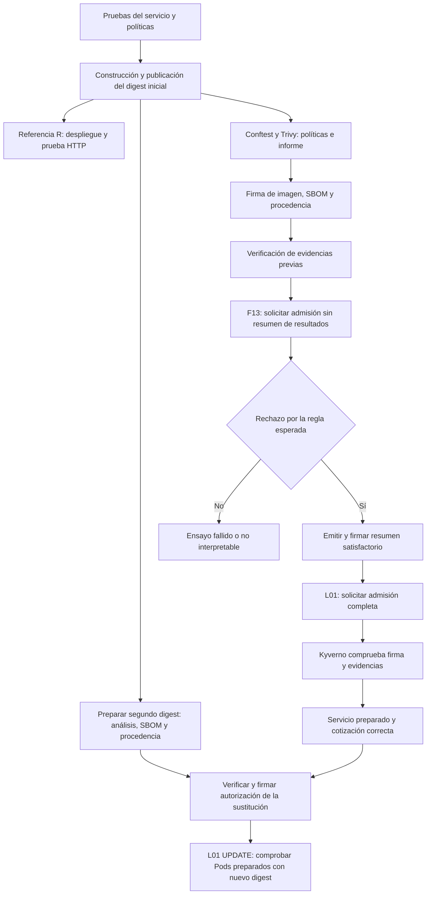

# Caso integrado L01/F13: entrega autorizada y resumen obligatorio ausente

[Documentación en español](../../README.md)

[Ficha en inglés](../../../EN/cases/L01-F13/README.md). Esta explicación en español describe la misma implementación y los mismos criterios de aceptación.

## Selección y propósito

Se elige la combinación de **L01 (entrega legítima)** y **F13 (atestación de resultados ausente)** porque obliga a integrar los controles previos y su consumo en admisión. Una prueba de firma aislada comprobaría una propiedad más pequeña; F13 solo es interpretable si la imagen, su firma, el SBOM y la procedencia ya son válidos. L01 sirve como control positivo de la misma configuración.

El servicio `quotes-node` aporta un contrato funcional determinista. El objeto de evaluación es la **decisión de autorización de una entrega identificada por digest**, no la sofisticación de la API ni una simulación actuarial. El resumen firmado recoge resultados previos de verificación; no declara que el despliegue ya haya sido admitido.

| Campo | Definición de esta primera demostración |
|---|---|
| Identificación | L01 + F13, ensayo integrado previo al piloto estadístico. |
| Activo | Imagen `linux/amd64` de `quotes-node`, evidencias asociadas y petición de despliegue en `tfm-golden`. |
| Capacidad acotada | Presentar una imagen con las demás evidencias válidas antes de emitir el resumen obligatorio. No se permite cambiar la política, la confianza ni la administración del clúster. |
| Condición de fallo F13 | No existe una atestación firmada de resultados válida para el digest presentado. |
| Fase esperada | Admisión de Kubernetes, en una comprobación dirigida de la barrera posterior. |
| Límite de bloqueo | Antes de admitir la carga protegida; no se considera suficiente detectar el problema después de su ejecución. |
| Oráculo F13 | Rechazo atribuible a la política de resultados obligatorios, con el resto de condiciones verificadas. |
| Oráculo L01 | Admisión inicial y respuesta saludable; después, UPDATE autorizado a otro digest de imagen, con el Deployment y los Pods preparados ejecutándolo y conservando el contrato de cotización. |
| Evidencia | Digest, configuración de confianza, políticas, informes, verificaciones, respuestas de admisión y resultado HTTP. |
| Alcance | Vía A local y vía B alojada, con mecanismos de identidad distintos y documentados. |

## Flujo y orden de preparación

Se usa un estado de ejecución aislado para que el digest no herede un resumen satisfactorio de un ensayo anterior. **F13 se ejecuta antes de publicar dicho resumen**; no se elimina una evidencia de una entrega ajena ni se rebaja la política para conseguir el rechazo. Si el registro ya contiene una autorización válida reutilizable para el objeto de esta prueba, no se puede dar por demostrada la ausencia y el ensayo debe aislarse de nuevo.

Tras F13, el emisor publica el resumen únicamente si los controles obligatorios previos están satisfechos. Este resumen no incluye como requisito circular una admisión que todavía no se ha producido. La autorización final de Kyverno y la respuesta funcional se registran después.

L01 también sustituye la imagen en ejecución. Una segunda construcción utiliza el mismo commit fuente y una etiqueta de construcción del laboratorio distinta para obtener otro digest inmutable; comprueba la sustitución de imagen, no una actualización funcional de la aplicación. Ese digest recibe su propio informe Trivy, SBOM, firma, procedencia y resultados firmados. El UPDATE debe superar los controles de admisión existentes, completar el despliegue y dejar Pods preparados cuyo identificador de imagen en ejecución corresponda al nuevo digest. Las evidencias de la imagen inicial no autorizan su sustitución.

## Propiedades y controles integrados

| Propiedad exigida | Implementación del laboratorio | Evidencia observable |
|---|---|---|
| Comportamiento funcional conocido | Node, `node:test`, salud, versión y cotización | Tests y respuestas de la aplicación desplegada. |
| Artefacto inmutable y común | Publicación en zot o GHCR y uso de digest SHA-256 | Referencia de imagen compartida por análisis, firma y despliegue. |
| Configuración restringida | Conftest y reglas de admisión: no root, sin privilegios ni escalada, capacidades eliminadas, sistema de archivos de solo lectura, restricciones de acceso al anfitrión | Resultado de políticas y manifiesto presentado. |
| Uso controlado de workflows | Reglas sobre acciones fijadas, eventos y permisos | Diagnóstico de Conftest sobre los workflows evaluados. |
| Umbral de vulnerabilidades | Trivy, HIGH/CRITICAL bloqueantes incluso sin corrección | Informe original y decisión de la regla. |
| Inventario asociado al artefacto | CycloneDX JSON original dentro de una atestación firmada | SBOM conservado, tipo, versión, sujeto y verificación. |
| Autenticidad de la imagen | Firma Cosign | Firma verificable para el digest e identidad autorizados. |
| Procedencia comprobable | Contrato local firmado en A; atestación alojada de GitHub consumida como Sigstore bundle en B | Correspondencia con repositorio, commit, construcción e identidad permitidos. |
| Autorización de resultados | Resumen propio versionado e inspirado en VSA, firmado con Cosign | Tipo de predicado, sujeto, política, resultados previos e identidad. |
| Aplicación de las condiciones | Kyverno en el namespace protegido, con comprobaciones directas | Rechazo F13 y aceptación L01 diferenciados por su causa. |

El resumen de resultados es un **contrato propio**, no una declaración de conformidad completa con toda la especificación VSA. Tampoco sustituye las comprobaciones directas de firma, SBOM y procedencia en admisión. Las políticas se ejecutan en un clúster Kubernetes real de laboratorio, creado con kind dentro de Docker; no se simula la decisión mediante una respuesta prefabricada de la API del servicio.

Las dos vías conservan estas propiedades pero no acreditan lo mismo. La clave local de A permite comprobar contratos y firmas de desarrollo. La identidad OIDC, la transparencia y el consumo de la procedencia real de GitHub se comprueban en B. No se declara SLSA Build L3 por haber obtenido una firma o una atestación.

## Decisión y tratamiento de errores

La comprobación dirigida F11 usa `privileged=true` junto con `allowPrivilegeEscalation=true`. Kubernetes considera inválida la combinación de privilegios con escalada explícitamente desactivada; esa entrada fallaría antes de evaluar Kyverno. Por ello, el demostrador confirma primero mediante `--dry-run=server` en R que la alteración es válida para la API y conserva ese diagnóstico. Después comprueba el rechazo temprano de Conftest y el rechazo de la actualización en G por `tfm-runtime`. El dry-run no modifica la carga de referencia.

| Estado observado | Interpretación |
|---|---|
| F13 rechazado por ausencia del resumen; L01 inicial y su UPDATE a otra imagen admitidos, preparados y funcionales | Se satisface el oráculo de esta demostración, dentro de las versiones y condiciones registradas. |
| F13 admitido | Fallo de eficacia de la barrera o de aislamiento del ensayo; se conserva como resultado desfavorable. |
| F13 rechazado por otra evidencia ausente o inválida | No permite atribuir el resultado al resumen obligatorio. Hay que corregir la preparación y repetir la comprobación. |
| Fallo de red, verificador, registro o webhook | Incidencia operativa; no se contabiliza como detección correcta de F13. |
| Vulnerabilidad bloqueante antes de llegar a F13 | El control previo funciona, pero la integración L01/F13 no se ha completado. |
| L01 admitido pero servicio no preparado o cotización incorrecta | La entrega funcional falla aunque haya superado la admisión. |

El éxito no se deduce del código de salida genérico de `kubectl`. Se conserva el diagnóstico y se comprueba la regla responsable. La existencia de un paquete de evidencias tampoco implica que todos sus pasos hayan terminado correctamente.

## Comparación y límites

R y G comparten inicialmente el servicio y el digest. Después, L01 utiliza un segundo digest solo en G para comprobar una sustitución legítima de imagen. La comparación inicial expone qué condiciones añade G y permite observar que R no exige el resumen experimental. La construcción adicional para UPDATE no constituye una pareja independiente R/G: esta demostración no acredita una tasa de detección general, ni cubre los veinte escenarios, ni constituye una campaña válida de tiempos.

La ausencia del resumen es una inyección controlada que modela una entrega incompleta o una vía que no aporta la autorización requerida. No demuestra resistencia al compromiso total del administrador, del runner autorizado o de la raíz de confianza. Tampoco acredita ausencia de malware ni cumplimiento normativo completo. La trazabilidad obtenida puede aportar evidencia técnica a la gestión del riesgo y del cambio, pero su aplicación a una aseguradora exige contexto organizativo y controles adicionales.

La [guía de ejecución](runbook.md) distingue los comandos locales, el workflow alojado, los resultados esperados y los fallos de preparación. El piloto posterior deberá comprobar interoperabilidad real, consumo de recursos y reproducibilidad antes de fijar las condiciones de campaña.
