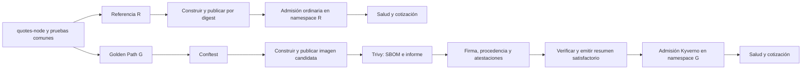

# Plan de la primera base integrada

[Documentación en español](README.md)

[Guía del plan en inglés](../EN/implementation-plan.md). Este documento conserva el plan de origen en español; sus observaciones históricas no se reinterpretan como ejecuciones nuevas.

Este documento conserva el **plan de origen de la primera base integrada**: `quotes-node`, el recorrido de referencia R y el Golden Path G. La base ya contiene código, pruebas y automatización para la demostración L01/F13, con comprobaciones tempranas y dirigidas de F11. Disponer de esta implementación no acredita todavía el cierre de sus pruebas de extremo a extremo ni la campaña de veinte escenarios.

El [README](../../README.md) y la [guía del caso completo](cases/L01-F13/runbook.md) describen los **comandos actuales**; los [contratos de entrega](delivery-contracts.md) delimitan las garantías implementadas. Las estructuras y etapas prospectivas que se conservan a continuación explican cómo se planteó el trabajo, pero no sustituyen esa guía operativa. El [TODO](../../TODO.md) sigue siendo el registro de avance y distingue la disponibilidad del código de su aceptación mediante ejecuciones observadas. La base integrada precede al piloto y a la campaña.

## 1. Punto de partida comprobado

| Elemento | Estado observado | Consecuencia para el plan |
|---|---|---|
| Devcontainer local y adaptador de Codespaces | Preparados, con versiones y referencias fijadas. | Reutilizar ambos; no sustituirlos por una segunda configuración. |
| `make test-env`, `make doctor`, `make smoke-env` | Implementados. Las tres pruebas Node pasan en el anfitrión durante la revisión. | Cerrar la ejecución completa en el contenedor Linux antes de integrar el servicio. |
| Evidencia `environment/run-T0FR3uip` | Fallo por ausencia de Node en el entorno desde el que se invocó; anterior a Docker y kind. | Conservarlo como fallo de preparación, sin atribuirlo al servicio ni al devcontainer. |
| Sonda actual | Construye una imagen y la carga directamente en kind. | No comprueba registro, descarga por digest, firmas ni admisión. |
| Servicio, políticas y workflows de entrega | Implementados para R y la demostración L01/F13, con comprobaciones de F11. | Completar la aceptación de extremo a extremo en A y B; no inferirla de las pruebas unitarias. |
| Herramientas adicionales | Trivy, Conftest, Cosign, Helm, Kyverno CLI y act incorporados al instalador; zot y Kyverno fijados en `tools.lock.json`. | Mantener hashes/digests y comprobar compatibilidad en la integración real. |

Las pruebas del anfitrión se ejecutaron con Node `v24.18.0`; no acreditan la ejecución del Node `v24.21.0` fijado para el devcontainer. El estado de un Codespace no se deduce de los archivos locales. El [registro de entorno](../../registros/validacion_entorno.md) conserva ese alcance.

Un detalle a resolver desde el primer incremento: `.dockerignore` de `implementacion` permite únicamente los archivos de preparación del devcontainer. La imagen del servicio se construirá con **contexto propio `services/quotes-node/`**, su Dockerfile y su `.dockerignore`; construirla con el contexto raíz actual excluiría su código.

## 2. Resultado mínimo que se quiere demostrar

La primera demostración completa debe permitir observar:

1. El servicio legítimo responde de forma idéntica en R y G.
2. G construye y entrega una imagen identificada, genera y verifica sus evidencias y obtiene autorización de admisión.
3. Una configuración prohibida se detiene temprano con un motivo concreto; una prueba dirigida comprueba la barrera posterior de admisión.
4. La ausencia de una evidencia obligatoria produce un rechazo atribuible a su regla, distinto de un fallo de red o del verificador.
5. La integración alojada verifica identidad OIDC y procedencia reales con Kyverno, además de las comprobaciones locales.

No se exige desarrollar las veinte inyecciones para alcanzar esta demostración. Tampoco se considera completo L01 mientras falte alguno de sus requisitos: un recorrido parcial se identificará como prueba de integración, no como resultado del catálogo completo.

## 3. Servicio `quotes-node`

### Contrato funcional propuesto

API HTTP sintética, sin datos personales, base de datos, interfaz gráfica ni servicios externos. Empleará Node y `node:test`; la primera versión puede utilizar `node:http` sin dependencias de producción. Se separarán transporte, validación y cálculo. Las reglas siguientes son exclusivamente datos de prueba y no un modelo actuarial.

| Operación | Entrada | Respuesta esperada |
|---|---|---|
| `GET /healthz` | Sin parámetros | `200`, `{"status":"ok"}`. |
| `GET /version` | Sin parámetros | `200`, nombre del servicio, versión y commit de construcción. Los valores deben coincidir con la entrega. |
| `POST /quotes` | JSON con `insuredAmountCents` y `coverage` | `200`, importe sintético en céntimos, moneda y versión de tarifa. |

Para la cotización, `insuredAmountCents` será un entero entre 100 y 100000000, ambos incluidos; `coverage` admitirá `basic` o `extended`. La tarifa será respectivamente 1 % o 2 %, redondeada hacia arriba al céntimo. Se rechazará una entrada inválida con `400` y un código identificable, por ejemplo `INVALID_REQUEST`. No se aceptarán importes negativos, fraccionarios, campos obligatorios ausentes o coberturas desconocidas.

```json
{"insuredAmountCents":100000,"coverage":"basic"}
```

Resultado esperado:

```json
{"currency":"EUR","premiumCents":1000,"tariffVersion":"demo-v1"}
```

El cálculo usará aritmética entera; no incluirá reloj, aleatoriedad ni tasas externas. Se probarán cálculo, validación, salud y contrato HTTP. El servicio escuchará en el puerto 3000, se ejecutará como usuario no privilegiado y permitirá un sistema de archivos de solo lectura. El mismo contrato se utilizará en Docker, kind y GitHub Actions.

La ausencia inicial de dependencias npm simplifica el arranque, pero no demuestra detección de vulnerabilidades de ese ecosistema. El análisis real de la imagen incluye sus componentes disponibles. F03/F04 requerirán después una entrada real comprobada y preparada conforme a sus fichas; no se añadirá una dependencia vulnerable a la versión legítima solo para producir un hallazgo.

**Ficha de entregable sugerida:** «Como desarrollador, quiero entregar una versión comprobable de quotes-node para comparar el recorrido ordinario y el protegido». Sus tareas se descomponen por los hitos siguientes, sin abrir una historia por archivo o por comando.

## 4. Dos configuraciones y dos vías distintas

**R/G** designa qué controles forman parte del recorrido. **A/B** designa dónde se ejecuta y qué identidad acredita las evidencias. No son cuatro productos ni cuatro servicios diferentes.

| Aspecto | Referencia R | Golden Path G |
|---|---|---|
| Código y pruebas funcionales | Misma revisión y contrato. | Misma revisión y contrato. |
| Construcción y publicación | Automatizadas, una imagen `linux/amd64`. | Misma construcción funcional, con los controles añadidos. |
| Despliegue legítimo | Imagen por digest, manifiesto permitido y namespace de referencia. | Imagen por digest, manifiesto permitido y namespace protegido. |
| Políticas tempranas de seguridad | No impuestas como controles del experimento. | Conftest: privilegios, referencia por digest y reglas de workflows seleccionadas. |
| Análisis y evidencias de seguridad | No exigidos para autorizar R. | Trivy, SBOM atestado, firma de imagen, procedencia y resumen firmado de resultados. |
| Admisión | Sin las políticas G del experimento. Persisten las validaciones ordinarias de Kubernetes. | Kyverno verifica las condiciones obligatorias antes de admitir. |
| Evidencia común | Commit, configuración, imagen, versiones, despliegue y respuesta funcional. | Lo anterior y las evidencias de los controles. |

R conserva automatización y pruebas; no representa ausencia de procesos. La única aplicación legítima y los manifiestos funcionales serán comunes. Las diferencias se mantendrán en configuración y políticas, sin dos implementaciones de `quotes-node`.

La vía A empleará el devcontainer, Docker/Buildx, zot, kind y claves de desarrollo. `act` ejecutará la parte local compatible de los workflows. La vía B empleará GitHub Actions, GHCR, OIDC real, firma keyless y verificación de transparencia y procedencia. La confianza local no se aceptará como confianza de producción de B.



Publicar una imagen candidata permite analizar el objeto almacenado y asociar evidencias; no significa autorizarla para desplegar. Una construcción por recorrido entrega su referencia inmutable a todos los consumidores posteriores. No se reconstruirá otra imagen entre analizar, firmar y desplegar. Para depurar R/G puede reutilizarse un artefacto; esa ejecución se identificará como diagnóstico, no como pareja de medición que incluye construcción.

## 5. Organización del repositorio

La implementación se aloja en el repositorio separado `golden-path-lab`, conservando `implementacion/` como subdirectorio. GitHub necesita los workflows en `.github/workflows/` de la raíz; situarlos únicamente dentro de `implementacion/.github` no los activa. El árbol siguiente conserva la organización propuesta inicialmente como antecedente del plan. La implementación actual la simplifica mediante `scripts/demo.sh`, los validadores y el generador de políticas, y usa los workflows `ci.yml` y `golden-path.yml` en la raíz; no requiere todavía todos los archivos prospectivos del árbol. El README raíz describe la estructura efectiva.

```text
raiz-del-repositorio/
├── .devcontainer/implementacion/     Adaptador existente de Codespaces
├── .github/workflows/               Por incorporar
│   ├── validate.yml                 Pruebas sin publicación
│   ├── reference.yml                Entrada del recorrido R
│   ├── golden-path.yml              Entrada del recorrido G
│   └── build-image.yml              Construcción reutilizable
└── implementacion/
    ├── .devcontainer/               Entorno existente; instalación incremental
    ├── services/quotes-node/        API, tests, package-lock y contexto Docker
    │   ├── src/                    HTTP, validación y cálculo
    │   ├── test/
    │   ├── package.json
    │   ├── package-lock.json
    │   ├── Dockerfile
    │   └── .dockerignore
    ├── deploy/                     Base común Deployment/Service; configuración R/G
    ├── lab/                        kind, zot y valores de instalación de Kyverno
    ├── policies/
    │   ├── conftest/               Reglas separadas por tipo de entrada
    │   └── kyverno/                Verificaciones en el namespace protegido
    ├── contracts/                  Esquemas propios y referencias a formatos externos
    ├── scripts/
    │   ├── lab/                    Preparación, diagnóstico y limpieza acotada
    │   └── delivery/               Construcción, análisis, firma, verificación y despliegue
    ├── tests/
    │   ├── environment/            Sonda actual, sin convertirla en servicio
    │   ├── unit/                   Reglas y validadores
    │   ├── integration/            Registro, firma, atestaciones y admisión reales
    │   └── fixtures/               Entradas pequeñas identificadas
    ├── evidence/raw/               Salidas por ejecución, excluidas de Git
    ├── registros/                  Resúmenes revisados
    ├── docs/
    ├── Makefile                    Interfaz de comandos compartidos
    ├── TODO.md                     Registro único de avance
    └── versions.env                Versiones y referencias verificadas
```

La estructura anterior es un destino, no un inventario actual. Se crearán carpetas al añadir su primer componente y prueba. El servicio ya tiene un único lockfile y una imagen base de ejecución fijada por separado de la imagen del devcontainer: los compiladores y utilidades de desarrollo no deben entrar por accidente en la imagen entregada.

Los workflows serán envoltorios de comandos reutilizables. La emisión de evidencias de G quedará separada de R: un parámetro `reference` no debe permitir firmar resultados de seguridad satisfactorios sin ejecutar controles. La configuración de confianza no dependerá de datos arbitrarios suministrados por quien solicita el despliegue.

## 6. Hitos de implementación y condiciones de cierre

| Hito | Trabajo concreto | Resultado de aceptación y evidencia |
|---|---|---|
| H0. Entorno real | Construir el devcontainer; ejecutar los tres comandos existentes. | `test-env`, `doctor` y `smoke-env` satisfactorios en Linux; versiones, logs y limpieza revisados. |
| H1. Servicio | Escribir primero las pruebas del contrato; implementar API y Dockerfile propios. | Respuesta de cotización exacta, entradas inválidas rechazadas, salud y versión verificadas en Node y Docker. |
| H2. Recorrido R | Añadir zot y laboratorio kind; publicar y desplegar por digest; conservar resultado funcional. | El nodo descarga del registro, la aplicación queda preparada y responde. No basta `kind load` ni `imagePullPolicy: Never`. |
| H3. Primera barrera G en A | Instalar Kyverno y una regla de firma; firmar con clave de desarrollo. | Imagen legítima admitida y variante sin firma rechazada por la regla identificada. Verificar acceso al registro desde nodo y Kyverno. |
| H4. Integración crítica B | Ejecutar construcción alojada, GHCR, firma keyless y procedencia; verificar directamente en Kyverno. | Aceptación de origen autorizado y rechazo dirigido de evidencia ausente u origen prohibido. CLI sola o act no cierran el hito. |
| H5. G básico completo | Integrar Conftest, Trivy, SBOM atestado, procedencia y resumen propio firmado; conservar verificaciones directas. | Recorrido legítimo con todas las condiciones obligatorias del perfil y artefacto correlacionado, más negativas iniciales atribuibles. |
| H6. Demostración reproducible | Ejecutar R/G desde la documentación y conservar paquete de resultados; probar la parte local de workflows con act. | Otra ejecución reproduce el procedimiento y las expectativas, identifica errores y deja evidencias interpretables. |

H3 es una prueba acotada de firma y admisión: **todavía no se denomina Golden Path completo**. H4 se adelanta para resolver la compatibilidad de mayor incertidumbre antes de implementar todo el corpus. Las capacidades añadidas en H5 se construyen y prueban una a una; su tarea solo se cierra al revisar la evidencia correspondiente. Cada contrato incorporado requiere las pruebas positivas y negativas de sus garantías, aunque no todas sean escenarios medidos independientes.

Mientras se prepara el repositorio alojado pueden avanzar las reglas locales de H5. La demostración que integra todas las tecnologías, sin embargo, requiere cerrar H4: no puede concluirse solo con un Codespace y una firma de desarrollo. El usuario publicará los archivos; este plan no autoriza subidas, releases ni cambios remotos automáticos.

## 7. Integraciones que hay que comprobar expresamente

### Registro y red

Se recomienda un único zot de laboratorio y un clúster kind de un nodo para comenzar. Dos namespaces, `tfm-reference` y `tfm-golden`, distinguirán las configuraciones; Kyverno solo impondrá las reglas experimentales en el protegido. La preparación del laboratorio, ejecutada por su administrador, fija ese ámbito; el proceso de despliegue no podrá quitarlo o cambiarlo para evitar controles.

La dirección canónica del registro se fijará antes de firmar y se comprobará desde el cliente que publica, los nodos que descargan y el proceso Kyverno que recupera las evidencias. La configuración de DNS, puertos y HTTP/TLS debe cubrir esos tres consumidores. Un alias `localhost` de containerd no configura por sí mismo el acceso desde un Pod; esta diferencia está documentada por [kind](https://kind.sigs.k8s.io/docs/user/local-registry/).

El perfil A podrá usar un registro HTTP aislado de desarrollo si se configura explícitamente en todos los clientes. No se expondrá como servicio público ni se mezclará con las condiciones de confianza de B. Antes de elegir esa opción se probarán las versiones concretas de Cosign y Kyverno con ella. Un problema de transporte se resolverá como tal; no se eliminará la verificación criptográfica para obtener una aceptación.

La instalación de Kyverno, sus CRD y webhooks debe estar preparada antes del ensayo, con recursos asignados y comportamiento de fallo cerrado para el ámbito protegido. Los tiempos de creación del laboratorio se registran aparte. Si se usa Helm para instalarlo, se fijarán también Helm, el chart y sus valores; Helm será una herramienta auxiliar de instalación.

### Imagen y evidencias

El resultado de construir/publicar será la referencia por digest. Se conservarán plataforma y relación entre índice OCI y manifiesto ejecutable si ambos existen. Trivy analizará ese objeto y producirá **CycloneDX JSON original** y **un informe de vulnerabilidades separado**. Generar el inventario no se interpretará como haber aplicado la regla de vulnerabilidades. La documentación de [Trivy sobre SBOM](https://trivy.dev/docs/latest/supply-chain/sbom/) distingue generación y análisis.

HIGH o CRITICAL bloquearán incluso sin corrección; no se activará un filtro de vulnerabilidades sin parche. Una imagen legítima debe cumplirlo en el análisis real con datos identificados. Si no cumple, se revisará la base o la dependencia, conservando el diagnóstico; no se promete un PASS por elegir Node LTS. Los tests unitarios de la regla usarán informes sintéticos y la integración informes reales. [Trivy: filtrado](https://trivy.dev/docs/latest/configuration/filtering/).

Cosign producirá la firma de imagen y las atestaciones exigidas. No se confundirá una atestación firmada con la firma de imagen de F07. Para el SBOM se comprobarán recuperación, tipo de predicado y correspondencia del sujeto, además de autenticidad. La representación exacta de CycloneDX y del resumen propio debe verificarse con las versiones elegidas. [Cosign: verificación de atestaciones](https://docs.sigstore.dev/cosign/verifying/attestation/).

### Procedencia de GitHub y consumidor Kyverno

H4 fijará conjuntamente emisor, identidad, repositorio, workflow/constructor, commit, formato y ubicación de la procedencia. El [candidato de migración actual](cosign-bundle-migration.md) tiene PASS local de compatibilidad con recuperación estricta; siguen pendientes la confianza alojada y la admisión negativa real de F07. En campaña, R y G usarán la misma revisión fijada, omitiendo en R los controles experimentales de evidencias/admisión de G; los tiempos de desarrollo clásico y campaña bundle se mantienen separados. El candidato usa bundles de Sigstore para todas las evidencias obligatorias; compartir representación no acredita igual confianza ni recuperación correcta para los productores Cosign y GitHub. La prueba debe recorrer emisión, publicación, recuperación y decisión del consumidor real. [GitHub](https://docs.github.com/en/actions/how-tos/secure-your-work/use-artifact-attestations/use-artifact-attestations), [Kyverno y Sigstore](https://kyverno.io/docs/policy-types/cluster-policy/verify-images/sigstore/).

El plan inicial priorizaba un constructor reutilizable. La primera implementación utiliza la procedencia nativa emitida por `actions/attest` en el workflow manual y su verificación como `SigstoreBundle`. Esta decisión permite comprobar la integración real sin afirmar aislamiento de constructor ni SLSA Build L3. Si la combinación no es verificable, se conservará el error concreto antes de decidir una adaptación. La procedencia declarada y firmada con una clave de desarrollo en A comprueba el contrato local, pero no acredita identidad GitHub. Los [contratos de entrega](delivery-contracts.md) detallan esta separación.

Para la primera prueba alojada se recomienda crear kind en el propio runner de GitHub y verificar allí la imagen en GHCR. Así no hace falta exponer la API del clúster del Codespace. Una comprobación local posterior podrá consumir el mismo digest y evidencias, con acceso al registro configurado expresamente.

### Resumen de resultados y semántica de admisión

El resumen propio inspirado en VSA tendrá tipo y versión de esquema, sujeto, política/versionado, resultado, ejecución y referencias verificables a las evidencias. Solo se emitirá éxito después de completar los controles obligatorios previos a admisión; la decisión final de admisión se registra después, evitando una dependencia circular. El consumidor verificará identidad, firma, sujeto, tipo/esquema, política y resultado. El resumen no sustituye la firma de imagen ni las verificaciones directas acordadas.

Se comprobará explícitamente que la mutación automática de tags no oculta la infracción de F12 y que la caché de verificaciones no oculta la ausencia posterior de evidencias. La semántica prevista es rechazar una petición solo por etiqueta; la configuración elegida debe conservarla. Las negativas usarán estado aislado o restaurado y una política de caché documentada, sin reutilizar accidentalmente un éxito anterior. [Kyverno: verificación, mutación y caché](https://kyverno.io/docs/policy-types/cluster-policy/verify-images/overview/).

### act y la ejecución real

`act` se incorpora después de disponer de comandos funcionales; no se utiliza como sustituto de toda la plataforma GitHub. La prueba local permitirá comprobar rutas, parámetros y la secuencia compatible, conservando el resultado del servicio y sus evidencias. OIDC real, permisos y particularidades del runner se prueban en B. [Limitaciones de act](https://nektosact.com/not_supported.html).

## 8. Primera demostración: expectativas observables

| Ensayo inicial | Preparación | Resultado esperado en G | Evidencia mínima |
|---|---|---|---|
| Entrega legítima | Imagen y manifiesto conformes; controles obligatorios completados. | Admisión permitida, Pod preparado y respuesta de cotización exacta. | Referencia inmutable, evidencias verificadas, respuesta de admisión y prueba HTTP. |
| F11, control temprano | Modificar solo `privileged` en el manifiesto. | Conftest rechaza antes del despliegue por su regla de privilegios. | Entrada, regla, código y diagnóstico; no se solicita despliegue. |
| F11, barrera posterior | Presentar la misma condición a la admisión en un ensayo dirigido separado. | Kyverno rechaza la solicitud por la regla prevista. | Respuesta de API y nombre de política/regla, diferenciados del ensayo anterior. |
| F07, firma ausente | Mantener las demás evidencias válidas y retirar/omitir únicamente la firma de imagen en un estado aislado. | Rechazo atribuible a firma obligatoria ausente. | Estado preparado, consulta de evidencia y diagnóstico. |
| F09/F10, procedencia | Aislar respectivamente ausencia u origen no autorizado durante H4. | Rechazo por el requisito correspondiente, no por indisponibilidad de red. | Bundle/atestación, identidad y origen observados y decisión de Kyverno. |
| F13, resumen ausente | Imagen, SBOM y procedencia válidos; omitir solo el resumen obligatorio después de su emisión prevista. | Rechazo por autorización de resultados ausente. | Evidencias restantes, solicitud y motivo de rechazo. |

Estos ensayos verifican la integración y no reducen el corpus definitivo. Para aislar una barrera posterior se puede partir de una entrega previamente válida y modificar una condición; la preparación se registra y no modifica el emisor para que autorice entregas fallidas.

R debe aceptar la entrega legítima y responder a la misma prueba HTTP. Su comportamiento frente a condiciones adversas se observará, no se supondrá: Kubernetes y otras restricciones del entorno pueden impedir una solicitud aunque falten las políticas G. En la demostración inicial no es necesario materializar una carga privilegiada en R; puede observarse una solicitud `dry-run=server`, identificada como comprobación de admisión, sin atribuirle despliegue ni ejecución.

Un test de rechazo esperado termina satisfactoriamente si identifica la regla y causa previstas. Un error genérico de `kubectl`, una descarga fallida o una prueba no alcanzada no cuentan como detección. Los datos distinguirán resultado del test, decisión del control y estado operativo.

## 9. Comandos y evidencias de la base

### Comandos actuales

Desde `implementacion/`, dentro del devcontainer:

```bash
make test-env
make doctor
make smoke-env
make test
make demo
make reference
```

`make test` reúne las pruebas del entorno, servicio, validadores y políticas. `make demo` coordina la demostración local R/G con L01, F13 y las comprobaciones de F11; `make reference` ejecuta solo R. La vía B utiliza el workflow manual de la raíz. La [guía operativa](cases/L01-F13/runbook.md) define preparación, resultados esperados, diagnóstico y limpieza.

### Interfaz adicional del plan original

La tabla siguiente conserva opciones del diseño inicial; no todos esos alias existen ni es necesario añadirlos para ejecutar la demostración actual. `make reference`, `make demo` y `make test-policies` ya están disponibles. Las restantes entradas se mantienen como posibilidades de organización posterior; se debe usar el `Makefile` actual y la guía para ejecutar el laboratorio.

| Comando previsto | Propósito |
|---|---|
| `make test-service` | Ejecutar el contrato y las pruebas de quotes-node. |
| `make lab-up` / `make lab-down` | Preparar o retirar únicamente recursos identificados del laboratorio. |
| `make reference` | Recorrido R completo y prueba funcional. |
| `make golden` | Recorrido G completo y prueba funcional. |
| `make test-policies` | Ejecutar pruebas de reglas sin desplegar el servicio. |
| `make test-integration` | Comprobar registro, firmas, atestaciones y admisión reales. |
| `make demo` | Ejecutar la demostración legítima y negativas seleccionadas, con resumen final. |
| `make test-workflow-local` | Ejecutar mediante act la parte local compatible. |

Se evitará un comando genérico que elimine clústeres ajenos o reutilice el contexto Kubernetes habitual sin comprobarlo. Cada ejecución usará un identificador propio y parámetros explícitos. El registro conservará al menos:

- Commit, configuración R/G, vía A/B, perfil de controles, versiones y política.
- Referencia de imagen, plataforma y correspondencia de digests.
- Informes originales, atestaciones y resultados de verificación cuando correspondan.
- Solicitud/respuesta de admisión y regla responsable, distinguiendo aceptación, rechazo y error.
- Prueba de salud/cotización y tiempos observados, sin tratarlos todavía como campaña.

Los datos completos irán a `evidence/raw/<run-id>/`, ya excluido de Git. El resumen revisado podrá conservarse en `registros/`. La ejecución en GitHub producirá un artefacto con los resultados, también ante un fallo cuando sea posible; su descarga y la copia local forman parte de H6. El paquete asociado a una release se completa después, conforme al protocolo vigente, sin añadir cifrado ni otro servicio de custodia.

## 10. Configuración pendiente antes de ejecutar B

Se deben fijar el repositorio y revisión que se publicarán, las rutas de workflows, las identidades admitidas y los permisos de GHCR. No se necesitan credenciales dentro de este plan ni se guardarán claves privadas en Git. Las claves de A quedarán en almacenamiento local ignorado y no se aceptarán en B.

El conjunto actual de versiones se conserva como punto de partida documental, sin actualizarlo arbitrariamente. Cada herramienta añadida debe tener versión, origen, hash/digest, licencia y comprobación de compatibilidad registrados. Las cuotas y recursos efectivos se comprueban antes de ejecutar; la cuenta de estudiante no se interpreta como capacidad ilimitada. No se introduce un servicio de pago para completar la base.

La asistencia con Copilot sigue el método aprobado: requisito y oráculo humanos, encargo acotado, pruebas automáticas y revisión humana. El repositorio incorpora una [guía de contribución](../../../CONTRIBUTING.md), `AGENTS.md` en la raíz, instrucciones para Copilot y una skill acotada para cambios de escenarios. La [guía de asistencia](ai-assisted-development.md) explica su uso y el registro ligero de evidencias. Antes de dar por completada la adopción operativa, se comprobará que el cliente de Copilot elegido carga los ficheros y se validará el proceso con una tarea acotada. Los borradores históricos no son configuración activa; los hooks, agentes personalizados e integraciones MCP siguen siendo opcionales. La revisión automática no sustituye la revisión humana y la IA queda excluida de las tareas manuales medidas y de la autorización durante la ejecución.

## 11. Cierre y siguiente trabajo

La base estará terminada cuando el servicio, R, G, la integración B y las negativas iniciales produzcan evidencias interpretables, con sus límites declarados. Haber instalado todos los ejecutables o disponer de YAML no basta. Si una comprobación falla, se conserva la observación y se resuelve o se delimita la incompatibilidad antes de declarar cerrada esa integración.

Después se completarán las fichas e inyecciones pendientes del catálogo, las comprobaciones de contratos que correspondan a incrementos posteriores, las cuatro parejas del piloto y las seis tareas manuales ya acordadas. La campaña mantendrá sus versiones fijadas y su previsión revisable de diez parejas. Este plan no cambia el presupuesto global, no agrega una comparación entre motores y no convierte la primera demostración en una evaluación estadística.
